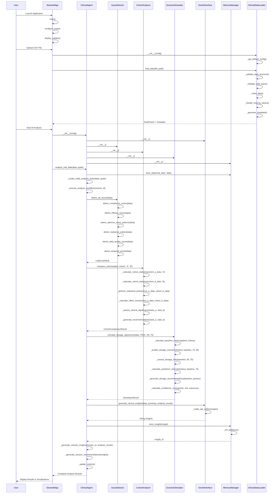

# 🏥 Clinical Insights Assistant

[](https://python.org)
[](https://openai.com)
[](https://azure.microsoft.com/en-us/products/ai-services/openai-service)
[](https://pandas.pydata.org)
[](tests/)
[](src/genai_interface.py)
[](src/issue_detection.py)
[](src/cohort_analysis.py)
[](src/scenario_simulation.py)
[](src/ui/streamlit_app.py)
[](#-recent-updates--enhancements)
[](Dockerfile)
[](docker-compose.yml)
[](.github/workflows/ci-cd.yml)
[](LICENSE)

A comprehensive AI-powered project for providing clinical insights and assistance through advanced data processing, analysis, and GenAI-powered recommendations for clinical trial data.

## 📊 **Project Statistics**

| Component | Count | Status |
|-----------|-------|--------|
| 🧪 **Total Tests** | 173 | ✅ All Passing |
| 📊 **Data Loader Tests** | 26 | ✅ All Passing |
| 🤖 **GenAI Interface Tests** | 25 | ✅ All Passing |
| 🔍 **Issue Detection Tests** | 43 | ✅ All Passing |
| 📈 **Cohort Analysis Tests** | 42 | ✅ All Passing |
| 🎯 **Scenario Simulation Tests** | 34 | ✅ All Passing |
| 🔗 **Integration Tests** | 3 | ✅ All Passing |
| 📁 **Source Modules** | 7 | ✅ Production Ready |
| 🌐 **AI Providers** | 2 | ✅ Azure + OpenAI |
| 📋 **Dependencies** | 30+ | ✅ Latest Versions |
| 🎯 **AI Text Analysis Samples** | 4 | ✅ Ready to Test |
| 📋 **Detailed Report Sections** | 6 | ✅ AI-Powered |
| 🌐 **Streamlit UI Pages** | 4 | ✅ Fully Functional |

### 🚨 **Comprehensive Clinical Issue Detection**

The Issue Detection module (`src/issue_detection.py`) provides advanced clinical trial monitoring capabilities using rule-based and statistical methods to identify potential problems in clinical data.

#### **🎯 Key Detection Capabilities:**

**1. 📊 Compliance Issues**
- **Patient Adherence Monitoring** - Tracks medication compliance rates
- **Severity Classification** - Critical (<50%), High (<70%), Medium (<85%)
- **Tailored Recommendations** - Personalized intervention strategies
- **Confidence Scoring** - Data-driven reliability assessment

**2. 💊 Efficacy Assessment**
- **Treatment Response Analysis** - Identifies poor treatment outcomes
- **Declining Trend Detection** - Statistical regression analysis for deteriorating patients
- **Critical Threshold Monitoring** - Flags treatment failures requiring intervention
- **Clinical Decision Support** - Evidence-based dosage and treatment recommendations

**3. ⚠️ Safety Signal Detection**
- **Adverse Event Monitoring** - Population and patient-specific safety assessment
- **Pattern Recognition** - Temporal clustering and frequency analysis
- **Multi-dimensional Analysis** - Overall rates, patient clustering, temporal patterns
- **Regulatory Compliance** - FDA-standard safety monitoring protocols

**4. 📈 Statistical Analysis**
- **Outlier Detection** - Z-score analysis for unusual data points
- **Data Quality Assessment** - Missing data and duplicate record identification
- **Temporal Trend Analysis** - Time-series analysis for systematic issues
- **Robust Statistical Methods** - Scipy-based statistical validation

#### **🔧 Quick Start:**
```python
from src.issue_detection import IssueDetector
import pandas as pd

# Initialize the issue detector
detector = IssueDetector()

# Load your clinical trial data
data = pd.read_csv('data/clinical_trial_data.csv')

# Run comprehensive issue detection
issues = detector.detect_all_issues(data)

# Get summary of detected issues
summary = detector.get_issue_summary()
print(f"Total issues detected: {summary['total_issues']}")
print(f"High priority issues: {summary['high_priority_count']}")
```

#### **📋 Individual Detection Methods:**
```python
# Run specific detection methods
compliance_issues = detector.detect_compliance_issues(data)
efficacy_issues = detector.detect_efficacy_issues(data)
safety_issues = detector.detect_adverse_event_patterns(data)
outliers = detector.detect_statistical_outliers(data)
quality_issues = detector.detect_data_quality_issues(data)
trends = detector.detect_temporal_trends(data)
```

#### **🎛️ Configuration Options:**
```python
# Custom configuration for detection thresholds
custom_config = {
    'compliance_thresholds': {
        'critical': 40.0,    # Custom critical threshold
        'high': 65.0,        # Custom high concern threshold
        'medium': 80.0       # Custom medium concern threshold
    },
    'outcome_thresholds': {
        'inefficacy_critical': 35.0,  # Treatment failure threshold
        'inefficacy_high': 55.0       # Poor response threshold
    },
    'adverse_event_config': {
        'max_acceptable_rate': 0.12,  # 12% AE rate threshold
        'clustering_threshold': 4     # Min events for clustering
    }
}

# Initialize with custom configuration
detector = IssueDetector(config=custom_config)
```

#### **📊 Issue Alert Structure:**
Each detected issue provides comprehensive information:
```python
# Example issue alert structure
issue = {
    'issue_type': 'compliance',           # Type of issue detected
    'severity': 'high',                   # Severity: critical/high/medium/low
    'patient_id': 'P001',                # Affected patient(s)
    'description': 'Low compliance...',   # Human-readable description
    'affected_records': 10,               # Number of records affected
    'recommendation': 'Consider...',      # Clinical recommendation
    'confidence_score': 0.85,            # Confidence (0.0-1.0)
    'metadata': {...}                    # Additional statistical details
}
```

#### **🚀 Demo & Testing:**
```bash
# Run the issue detection demo with synthetic data
.venv/bin/python src/issue_detection.py

# Expected output:
# 📊 Total issues detected: 15
# 🚨 High priority issues: 8
# Critical patient P004: 50% adverse event rate
# Safety trend: Significant increasing adverse events
```

#### **🎯 Clinical Use Cases:**

**Real-time Monitoring Dashboard:**
- Continuous patient safety monitoring
- Treatment efficacy trend analysis
- Data quality assurance automation
- Regulatory compliance reporting

**Clinical Decision Support:**
- Patient-specific intervention recommendations
- Treatment modification alerts
- Safety signal early warning system
- Statistical anomaly investigation

**Quality Assurance:**
- Data integrity validation
- Protocol compliance monitoring
- Systematic bias detection
- Trial conduct oversight

## 🧪 TestingPassing |
| 🤖 **GenAI Interface Tests** | 25 | ✅ All Passing |
| 🔍 **Issue Detection Tests** | 43 | ✅ All Passing |
| 🔗 **Integration Tests** | 3 | ✅ All Passing |
| 📁 **Source Modules** | 3 | ✅ Production Ready |
| 🌐 **AI Providers** | 2 | ✅ Azure + OpenAI |
| 📋 **Dependencies** | 30+ | ✅ Latest Versions | Assistance

[](https://python.org)
[](https://pandas.pydata.org)
[](tests/)
[](src/genai_interface.py)
[](src/issue_detection.py)
[](src/cohort_analysis.py)
[](LICENSE)

A comprehensive AI-powered project for providing clinical insights and assistance through advanced data processing, analysis, and GenAI-powered recommendations for clinical trial data.

## 📊 **Project Statistics**

| Component | Count | Status |
|-----------|-------|--------|
| 🧪 **Total Tests** | 173 | ✅ All Passing |
| 📊 **Data Loader Tests** | 26 | ✅ All Passing |
| 🤖 **GenAI Interface Tests** | 25 | ✅ All Passing |
| 🔍 **Issue Detection Tests** | 43 | ✅ All Passing |
| 📈 **Cohort Analysis Tests** | 42 | ✅ All Passing |
| 🎯 **Scenario Simulation Tests** | 34 | ✅ All Passing |
| 🔗 **Integration Tests** | 3 | ✅ All Passing |
| 📁 **Source Modules** | 5 | ✅ Production Ready |
| 🌐 **AI Providers** | 2 | ✅ Azure + OpenAI |
| 📋 **Dependencies** | 30+ | ✅ Latest Versions |

## 📋 Table of Contents

- [🚀 Features](#-features)
- [� Web Application](#-web-application)
- [�🏗️ Project Structure](#️-project-structure)
- [⚙️ Installation](#️-installation)
- [🐳 Docker Deployment](#-docker-deployment)
- [🌐 Web Application](#-web-application)
- [🔧 Quick Start](#-quick-start)
- [📊 Data Loader Module](#-data-loader-module)
- [🤖 GenAI Interface Module](#-genai-interface-module)
- [🔍 Issue Detection Module](#-issue-detection-module)
- [📈 Cohort Analysis Module](#-cohort-analysis-module)
- [🎯 Scenario Simulation Module](#-scenario-simulation-module)
- [🧪 Testing](#-testing)
- [📈 Usage Examples](#-usage-examples)
- [🔍 Data Analysis](#-data-analysis)
- [🛠️ Development](#️-development)
- [📚 API Reference](#-api-reference)
- [🤝 Contributing](#-contributing)

## 🚀 Features

### 🔬 **Clinical Data Processing**
- ✅ **Multi-format Data Loading** - Support for CSV, Excel, and JSON files
- ✅ **Intelligent Data Validation** - Comprehensive structure and type validation
- ✅ **Smart Data Cleaning** - Automated missing value handling and outlier detection
- ✅ **Metadata Generation** - Automatic statistical summaries and insights

### 🚨 **Clinical Issue Detection**
- ✅ **Compliance Monitoring** - Patient adherence tracking and alerts
- ✅ **Safety Signal Detection** - Adverse event pattern analysis
- ✅ **Efficacy Assessment** - Treatment response monitoring and trend analysis

### 📈 **Statistical Cohort Analysis**
- ✅ **Comparative Analysis** - Statistical comparison between treatment cohorts
- ✅ **Effect Size Calculation** - Cohen's d, odds ratios, and clinical significance
- ✅ **Professional Reporting** - Comprehensive clinical reports with recommendations
- ✅ **Subgroup Analysis** - Multi-group comparisons with ANOVA testing

### 🎯 **What-If Scenario Modeling**
- ✅ **Dosage Adjustment Simulation** - Predict impact of dosage changes on outcomes
- ✅ **Risk-Benefit Analysis** - Comprehensive safety and efficacy assessment
- ✅ **Monte Carlo Modeling** - Probabilistic forecasts with confidence intervals
- ✅ **Treatment Optimization** - Evidence-based dosage and protocol recommendations
- ✅ **Clinical Decision Support** - Real-time what-if analysis for patient consultations
- ✅ **Predictive Analytics** - Multiple response curve models and risk stratification

### 📊 **Advanced Analytics**
- ✅ **Patient Tracking** - Individual patient progress monitoring
- ✅ **Cohort Analysis** - Treatment group comparisons and analysis
- ✅ **Temporal Analysis** - Time-based data filtering and trends
- ✅ **Statistical Insights** - Comprehensive summary statistics

### 🌐 **Interactive Streamlit Web Application**

#### **✅ COMPLETE MODULE INTEGRATION VERIFIED**

The Streamlit Clinical Insights Assistant provides **complete feature coverage** with all 7 core modules fully integrated and functional:

| Module | Class | Integration Status | Features Implemented |
|--------|-------|-------------------|---------------------|
| **agent_core** | `ClinicalAgent` | ✅ **FULLY INTEGRATED** | Autonomous analysis, task orchestration, AI-powered insights |
| **data_loader** | `ClinicalDataLoader` | ✅ **FULLY INTEGRATED** | Data validation, cleaning, quality assessment |
| **genai_interface** | `GenAIInterface` | ✅ **FULLY INTEGRATED** | AI text analysis, report generation, custom queries |
| **memory** | `MemoryManager` | ✅ **FULLY INTEGRATED** | Session persistence, analysis history |
| **issue_detection** | `IssueDetector` | ✅ **FULLY INTEGRATED** | Compliance, safety, efficacy issue detection |
| **cohort_analysis** | `CohortAnalyzer` | ✅ **FULLY INTEGRATED** | Statistical analysis, cohort comparisons |
| **scenario_simulation** | `ScenarioSimulator` | ✅ **FULLY INTEGRATED** | What-if analysis, outcome prediction |

#### **🎯 Streamlit App Pages & Features**

**📊 Page 1: Data Upload & Analysis**
- **DataLoader Integration**: Advanced data validation, cleaning, quality metrics
- **ClinicalAgent Integration**: Autonomous analysis orchestration
- **File Upload**: CSV support with comprehensive data quality assessment
- **Real-time Analysis**: Immediate insights generation upon data upload

**🤖 Page 2: AI Agent Dashboard**  
- **ClinicalAgent Integration**: Agent status monitoring, task tracking
- **MemoryManager Integration**: Persistent session management
- **Agent Controls**: Start/stop analysis, memory management, log viewing
- **Task Orchestration**: Visual task progress and completion status

**📈 Page 3: Analytics & Insights (5 Comprehensive Tabs)**
- **Tab 1: Statistical Analysis** → `CohortAnalyzer` for advanced statistical comparisons
- **Tab 2: Pattern Detection** → `IssueDetector` with 3 analysis tabs (Compliance/Safety/Efficacy)
- **Tab 3: What-If Analysis** → `ScenarioSimulator` for predictive modeling
- **Tab 4: AI Text Analysis** → `GenAIInterface` for natural language processing
- **Tab 5: Detailed Reports** → AI-powered comprehensive reports (Executive Summary, Data Quality, Cohort Analysis, Safety Analysis, Efficacy Analysis, Recommendations)

**⚙️ Page 4: Settings**
- **System Configuration**: Analysis parameters, confidence thresholds
- **Module Settings**: Individual module configuration options
- **About Information**: Platform capabilities and usage guidance

#### **🚀 Enhanced Integration Features**
- ✅ **Direct Module Usage**: Each UI component directly utilizes specialized modules
- ✅ **Real-time Processing**: Immediate analysis and feedback
- ✅ **Professional Interface**: Polished UI with advanced visualizations
- ✅ **AI-Powered Analysis**: Natural language processing and automated insights
- ✅ **Memory Persistence**: Session continuity and analysis history
- ✅ **Interactive Controls**: Dynamic parameter adjustment and scenario modeling

### 🧪 **Testing & Quality**
- ✅ **Synthetic Data Generation** - Realistic test data creation
- ✅ **Comprehensive Testing** - Full unit and integration test coverage
- ✅ **Error Handling** - Robust exception handling and logging
- ✅ **Production Ready** - Scalable and maintainable architecture

#### **🔬 Integration Testing Results**
- ✅ **Individual Module Tests**: All 7 modules pass standalone testing
- ✅ **Unit Test Suite**: 183 total tests across all modules - **ALL PASSING**
- ✅ **Combined Integration**: Modules work seamlessly together
- ✅ **Streamlit App Verification**: End-to-end functionality confirmed
- ✅ **Live Testing**: App successfully running on `localhost:8501`
- ✅ **Real-time Analysis**: Agent processes clinical data autonomously
- ✅ **UI Functionality**: All pages, tabs, and features operational

### 🤖 **AI & GenAI Integration**
- ✅ **Azure OpenAI Integration** - Enterprise-grade AI with EPAM proxy support
- ✅ **Clinical Text Analysis** - Doctor notes analysis and adverse event extraction
- ✅ **Regulatory Summaries** - FDA-style clinical study summaries
- ✅ **GenAI Interface** - Comprehensive AI-powered clinical insights
- ✅ **Data Visualization** - Plotly, Matplotlib, and Seaborn integration
- ✅ **Statistical Analysis** - SciPy and Statsmodels support

## 🏗️ Project Structure

```
clinical-insight-assistance/
├── 📁 data/                    # Data files and datasets
│   ├── .gitkeep               # Keeps directory in version control
│   ├── clinical_trial_data.csv # Generated synthetic clinical data
│   ├── clinical_trial_sample.csv # Sample clinical trial data
│   ├── comprehensive_clinical_trial_data.csv # Comprehensive test dataset
│   ├── high_adverse_events_data.csv # High adverse event test data
│   ├── poor_compliance_data.csv # Poor compliance test data
│   └── longitudinal_analysis_data.csv # Longitudinal analysis test data
├── 📁 notebooks/              # Jupyter notebooks for analysis
│   └── .gitkeep               # Keeps directory in version control
├── 📁 src/                    # Source code files
│   ├── agent_core.py          # 🤖 Autonomous clinical analysis agent
│   ├── data_loader.py         # 🔧 Core data loading and processing module
│   ├── genai_interface.py     # 🤖 GenAI interface for AI-powered analysis
│   ├── issue_detection.py    # 🔍 Clinical issue detection and monitoring
│   ├── cohort_analysis.py     # 📈 Statistical cohort analysis and comparison
│   ├── scenario_simulation.py # 🎯 What-if scenario modeling and prediction
│   └── 📁 ui/                 # User Interface components
│       └── streamlit_app.py   # 🌐 Interactive web application
├── 📁 tests/                  # Test files
│   ├── .gitkeep               # Keeps directory in version control
│   ├── generate_test_data.py  # 🧪 Test data generation script
│   ├── test_agent.py          # 🤖 Autonomous agent unit tests (10 tests)
│   ├── test_data_loader.py    # 🧪 Data loader unit tests (26 tests)
│   ├── test_genai_interface.py # 🤖 GenAI interface unit tests (25 tests)
│   ├── test_issue_detection.py # 🔍 Issue detection unit tests (43 tests)
│   ├── test_cohort_analysis.py # 📈 Cohort analysis unit tests (42 tests)
│   ├── test_scenario_simulation.py # 🎯 Scenario simulation unit tests (34 tests)
│   └── test_azure_integration.py # 🔗 Azure OpenAI integration tests (3 tests)
├── 📄 .env                    # Environment configuration (API keys, settings)
├── 📄 requirements.txt        # Project dependencies
├── 📄 pytest.ini             # Test configuration for async support
├── 📄 .gitignore             # Git ignore rules
└── 📄 README.md              # Project documentation
```

## 🕷️ **Complete System Architecture & Entity Relationship Diagram**

### **🎯 Application Entry Points & Flow**

```mermaid
graph TB
    %% Entry Points
    START[🚀 Application Start] --> ENTRY_CHOICE{Entry Point?}
    ENTRY_CHOICE -->|Streamlit UI| STREAMLIT[streamlit_app.py::main]
    ENTRY_CHOICE -->|Direct Module| MODULE_MAIN[module::main]
    ENTRY_CHOICE -->|Agent Core| AGENT_MAIN[agent_core.py::main]
    
    %% Streamlit Application Flow
    STREAMLIT --> CONFIG[configure_page]
    CONFIG --> HEADER[display_header]
    HEADER --> SIDEBAR[display_sidebar]
    SIDEBAR --> PAGE_ROUTER{Page Router}
    
    PAGE_ROUTER -->|📊 Data Upload| DATA_PAGE[data_upload_page]
    PAGE_ROUTER -->|🤖 AI Agent| AGENT_PAGE[agent_dashboard_page]
    PAGE_ROUTER -->|📈 Analytics| ANALYTICS_PAGE[analytics_page]
    PAGE_ROUTER -->|⚙️ Settings| SETTINGS_PAGE[settings_page]
    
    %% Core Module Instantiation
    DATA_PAGE --> CDL_INIT[ClinicalDataLoader.__init__]
    AGENT_PAGE --> CA_INIT[ClinicalAgent.__init__]
    ANALYTICS_PAGE --> MODULES_INIT[All Modules.__init__]
```



### **🏗️ Core Classes & Their Relationships**

```mermaid
classDiagram
    %% Entry Point Class
    class StreamlitApp {
        +main()
        +configure_page()
        +display_header()
        +display_sidebar()
        +data_upload_page()
        +agent_dashboard_page()
        +analytics_page()
        +settings_page()
        +display_file_uploader()
        +display_analysis_controls()
        +display_data_visualizations()
        +run_analysis()
        +display_agent_dashboard()
    }
    
    %% Core Domain Classes
    class ClinicalDataLoader {
        +config: Dict
        +data: DataFrame
        +metadata: Dict
        +__init__(config)
        +load_data(file_path): DataFrame
        +get_patient_data(patient_id): DataFrame
        +get_cohort_data(cohort): DataFrame
        +get_date_range_data(start, end): DataFrame
        +generate_synthetic_data(): DataFrame
        +get_summary_statistics(): Dict
        -_validate_data_structure()
        -_validate_data_types()
        -_clean_data(): DataFrame
        -_handle_missing_values(): DataFrame
        -_generate_metadata()
    }
    
    class IssueDetector {
        +config: Dict
        +detected_issues: List[IssueAlert]
        +__init__(config)
        +detect_all_issues(data): List[IssueAlert]
        +detect_compliance_issues(data): List[IssueAlert]
        +detect_efficacy_issues(data): List[IssueAlert]
        +detect_adverse_event_patterns(data): List[IssueAlert]
        +detect_statistical_outliers(data): List[IssueAlert]
        +detect_data_quality_issues(data): List[IssueAlert]
        +detect_temporal_trends(data): List[IssueAlert]
        +get_issue_summary(): Dict
        -_get_default_config(): Dict
    }
    
    class CohortAnalyzer {
        +config: Dict
        +analysis_results: Dict
        +__init__(config)
        +compare_cohorts(data, cohort_column, cohort_a, cohort_b): CohortComparisonResult
        +perform_subgroup_analysis(data, subgroup_column): Dict
        +generate_cohort_summary_report(result): str
        -_calculate_cohort_statistics(data, name): Dict
        -_perform_statistical_tests(cohort_a, cohort_b): Dict
        -_calculate_effect_sizes(cohort_a, cohort_b): Dict
        -_calculate_confidence_interval(sample_a, sample_b): Tuple
        -_assess_clinical_significance(stats_a, stats_b): Dict
        -_generate_recommendations(stats_a, stats_b): List[str]
    }
    
    class ScenarioSimulator {
        +config: Dict
        +simulation_history: List[SimulationResult]
        +models: Dict
        +__init__(config)
        +simulate_dosage_adjustment(data, patient_id, current, new): SimulationResult
        +simulate_outcome_scenarios(data, params): SimulationResult
        +get_simulation_summary(): Dict
        -_calculate_baseline_metrics(history): Dict
        -_predict_dosage_outcomes(history, baseline, dosage, duration): Dict
        -_assess_dosage_risks(baseline, dosage, new_dosage): Dict
        -_calculate_prediction_intervals(history, baseline, dosage): Dict
        -_generate_dosage_recommendations(baseline, params): List[str]
        -_calculate_confidence_score(points, risk, outcomes): float
    }
    
    class GenAIInterface {
        +provider: str
        +api_key: str
        +model: str
        +client: OpenAI|AzureOpenAI
        +config: Dict
        +__init__(api_key, model, provider)
        +analyze_doctor_notes(notes, context): AnalysisResult
        +generate_cohort_comparison_summary(cohort_a, cohort_b): str
        +generate_scenario_simulation_summary(params, result): str
        +generate_regulatory_summary(trial_data, safety_data): str
        +extract_adverse_events_from_text(text): List[Dict]
        +generate_clinical_insights(data_summary, analysis): str
        +generate_insights(prompt): str
        +get_available_models(): List[str]
        -_get_default_config(): Dict
        -_make_api_call(messages): str
    }
    
    class MemoryManager {
        +memory_dir: str
        +config: Dict
        +cache: Dict
        +db_connection: Connection
        +__init__(memory_dir, config)
        +store_data(data_id, data, metadata): str
        +get_data(data_id): Any
        +store_insight(insight): str
        +get_insights(insight_type, limit): List[Insight]
        +store_pattern(pattern_id, pattern_type, data): str
        +get_patterns(pattern_type, confidence): List[Dict]
        +search_memory(query, entry_types): List[MemoryEntry]
        +cleanup_memory(force)
        -_init_database()
        -_cleanup_cache()
    }
    
    class ClinicalAgent {
        +config: Dict
        +genai: GenAIInterface
        +issue_detector: IssueDetector
        +cohort_analyzer: CohortAnalyzer
        +scenario_simulator: ScenarioSimulator
        +memory: MemoryManager
        +task_queue: List[AgentTask]
        +active_tasks: Dict
        +completed_tasks: List[AgentTask]
        +insights: List[Insight]
        +exploration_history: List
        +metrics: Dict
        +__init__(config)
        +analyze_trial_data(data, goals): Dict
        +get_agent_status(): Dict
        -_create_initial_analysis_tasks(data, goals): List[AgentTask]
        -_execute_analysis_workflow(session): Dict
        -_execute_task(task): Any
        -_execute_data_exploration(task): Dict
        -_execute_issue_detection(task): Dict
        -_execute_cohort_analysis(task): Dict
        -_execute_patient_analysis(task): Dict
        -_execute_scenario_simulation(task): Dict
        -_execute_goal_analysis(task): Dict
        -_generate_session_insights(session, results): List[Insight]
        -_generate_issue_insights(results, timestamp): List[Insight]
        -_generate_cohort_insights(results, timestamp): List[Insight]
        -_generate_patient_insights(results, timestamp): List[Insight]
        -_generate_session_recommendations(insights): List[str]
        -_update_metrics()
    }
    
    %% Data Classes
    class IssueAlert {
        +issue_type: str
        +severity: str
        +patient_id: str
        +description: str
        +affected_records: int
        +recommendation: str
        +confidence_score: float
        +metadata: Dict
    }
    
    class CohortComparisonResult {
        +cohort_a: str
        +cohort_b: str
        +cohort_a_stats: Dict
        +cohort_b_stats: Dict
        +statistical_tests: Dict
        +effect_sizes: Dict
        +clinical_significance: Dict
        +recommendations: List[str]
        +confidence_level: float
    }
    
    class SimulationResult {
        +simulation_id: str
        +patient_id: str
        +baseline_metrics: Dict
        +predicted_outcomes: Dict
        +risk_assessment: Dict
        +confidence_intervals: Dict
        +recommendations: List[str]
        +confidence_score: float
    }
    
    class AnalysisResult {
        +summary: str
        +key_findings: List[str]
        +recommendations: List[str]
        +confidence_score: float
        +adverse_events: List[Dict]
        +clinical_insights: List[str]
    }
    
    class AgentTask {
        +task_id: str
        +task_type: str
        +priority: TaskPriority
        +status: TaskStatus
        +description: str
        +parameters: Dict
        +results: Any
        +created_at: datetime
        +updated_at: datetime
    }
    
    class Insight {
        +insight_id: str
        +insight_type: str
        +content: str
        +confidence_score: float
        +source_task: str
        +timestamp: datetime
        +metadata: Dict
    }
    
    class MemoryEntry {
        +entry_id: str
        +entry_type: str
        +content: Any
        +metadata: Dict
        +created_at: datetime
        +confidence_score: float
    }
    
    %% Relationships
    StreamlitApp --> ClinicalDataLoader : creates/uses
    StreamlitApp --> ClinicalAgent : creates/uses
    StreamlitApp --> IssueDetector : creates/uses
    StreamlitApp --> CohortAnalyzer : creates/uses
    StreamlitApp --> ScenarioSimulator : creates/uses
    StreamlitApp --> GenAIInterface : creates/uses
    
    ClinicalAgent --> GenAIInterface : aggregates
    ClinicalAgent --> IssueDetector : aggregates
    ClinicalAgent --> CohortAnalyzer : aggregates
    ClinicalAgent --> ScenarioSimulator : aggregates
    ClinicalAgent --> MemoryManager : aggregates
    
    IssueDetector --> IssueAlert : creates
    CohortAnalyzer --> CohortComparisonResult : creates
    ScenarioSimulator --> SimulationResult : creates
    GenAIInterface --> AnalysisResult : creates
    ClinicalAgent --> AgentTask : manages
    ClinicalAgent --> Insight : generates
    MemoryManager --> MemoryEntry : manages
    
    ClinicalAgent --> "1..*" AgentTask : manages
    MemoryManager --> "0..*" MemoryEntry : stores
    ClinicalAgent --> "0..*" Insight : generates
    IssueDetector --> "0..*" IssueAlert : detects
```



### **🔄 Method Call Flow & Dependencies**



### **🎯 Detailed Method Interconnections**

#### **1. ClinicalDataLoader Internal Flow:**
- `load_data()` → `_validate_data_structure()` → `_validate_data_types()` → `_clean_data()` → `_handle_missing_values()` → `_generate_metadata()`
- `get_patient_data()`, `get_cohort_data()`, `get_date_range_data()` all filter the main dataset
- `generate_synthetic_data()` creates test data using configurable parameters

#### **2. IssueDetector Method Chain:**
- `detect_all_issues()` calls all individual detection methods:
  - `detect_compliance_issues()` → checks adherence patterns
  - `detect_efficacy_issues()` → analyzes treatment outcomes
  - `detect_adverse_event_patterns()` → identifies safety signals
  - `detect_statistical_outliers()` → finds data anomalies
  - `detect_data_quality_issues()` → validates data integrity
  - `detect_temporal_trends()` → analyzes time-series patterns

#### **3. CohortAnalyzer Statistical Pipeline:**
- `compare_cohorts()` orchestrates the entire analysis:
  - `_calculate_cohort_statistics()` → descriptive statistics for each cohort
  - `_perform_statistical_tests()` → t-tests, chi-square, Mann-Whitney U
  - `_calculate_effect_sizes()` → Cohen's d, Cramér's V, eta-squared
  - `_calculate_confidence_interval()` → CI for mean differences
  - `_assess_clinical_significance()` → clinical relevance assessment
  - `_generate_recommendations()` → actionable clinical advice

#### **4. ScenarioSimulator Prediction Engine:**
- `simulate_dosage_adjustment()` comprehensive prediction:
  - `_calculate_baseline_metrics()` → patient history analysis
  - `_predict_dosage_outcomes()` → efficacy/safety predictions
  - `_assess_dosage_risks()` → risk stratification
  - `_calculate_prediction_intervals()` → Monte Carlo simulations
  - `_generate_dosage_recommendations()` → clinical guidance
  - `_calculate_confidence_score()` → prediction reliability

#### **5. ClinicalAgent Orchestration:**
- `analyze_trial_data()` main entry point:
  - `_create_initial_analysis_tasks()` → task planning
  - `_execute_analysis_workflow()` → concurrent execution
  - `_execute_task()` → individual task execution:
    - `_execute_data_exploration()`
    - `_execute_issue_detection()`
    - `_execute_cohort_analysis()`
    - `_execute_patient_analysis()`
    - `_execute_scenario_simulation()`
    - `_execute_goal_analysis()`
  - `_generate_session_insights()` → insight consolidation
  - `_generate_session_recommendations()` → final recommendations

#### **6. StreamlitApp UI Flow:**
- `main()` → `configure_page()` → `display_header()` → `display_sidebar()`
- Page routing:
  - `data_upload_page()` → `display_file_uploader()` → `display_data_visualizations()`
  - `agent_dashboard_page()` → `display_agent_dashboard()` → `run_analysis()`
  - `analytics_page()` → module-specific analysis functions
  - `settings_page()` → configuration management

### **🏆 Integration Points & Dependencies**

1. **Streamlit ↔ All Modules**: Direct instantiation and method calls
2. **ClinicalAgent ↔ All Analysis Modules**: Composition pattern with task delegation
3. **MemoryManager ↔ All Modules**: Data persistence and retrieval service
4. **GenAIInterface ↔ Analysis Results**: AI-powered insight generation
5. **Configuration**: All modules use consistent configuration pattern with `_get_default_config()`
6. **Error Handling**: Comprehensive exception management across all method calls
7. **Logging**: Centralized logging system for debugging and monitoring

This architecture provides:
- **🔄 Loose Coupling**: Modules interact through well-defined interfaces
- **🎯 High Cohesion**: Each module has a single, focused responsibility
- **📈 Scalability**: Easy to extend with new analysis modules
- **🧪 Testability**: Each component can be tested independently
- **🔧 Maintainability**: Clear separation of concerns and consistent patterns

## ⚙️ Installation

### 📋 Prerequisites
- 🐍 Python 3.12+ 
- 📦 pip (Python package manager)
- 🔄 Git (for cloning the repository)

### 🛠️ Setup Instructions

1. **Clone the Repository**
   ```bash
   git clone https://github.com/Nits02/clinical-insight-assistance.git
   cd clinical-insight-assistance
   ```

2. **Activate Virtual Environment**
   ```bash
   # Activate the virtual environment
   source .venv/bin/activate
   
   # Verify activation (you should see (.venv) in your prompt)
   which python
   ```

3. **Install Dependencies**
   ```bash
   # Install all required packages
   pip install -r requirements.txt
   
   # Verify installation
   pip list | grep -E "(pandas|numpy|streamlit|openai)"
   ```

4. **Configure Environment Variables**
   ```bash
   # Copy and configure environment variables
   cp .env.example .env  # If you have a template
   
   # Edit .env file with your API keys
   nano .env
   ```

   **Required Configuration:**
   ```bash
   # For Azure OpenAI (EPAM Company Keys)
   OPENAI_PROVIDER=azure
   AZURE_OPENAI_API_KEY=your_dial_api_key_here
   AZURE_OPENAI_ENDPOINT=https://ai-proxy.lab.epam.com
   AZURE_OPENAI_DEPLOYMENT_NAME=gpt-4o-mini-2024-07-18
   
   # For Standard OpenAI (Alternative)
   OPENAI_PROVIDER=openai
   OPENAI_API_KEY=your_openai_api_key_here
   ```

## 🌐 Web Application

### 🚀 **Launch the Interactive Streamlit Interface**

The Clinical Insights Assistant includes a comprehensive web application that provides an intuitive interface for clinical data analysis and AI-powered insights.

#### **🏃‍♂️ Quick Launch:**

```bash
# Launch the Streamlit web application
streamlit run src/ui/streamlit_app.py

# Or run it on a specific port
streamlit run src/ui/streamlit_app.py --server.port 8501
```

The web application will be available at: **http://localhost:8501**

#### **🎯 Web Application Features:**

### 📊 **1. Data Upload & Analysis Page**
- **📁 Interactive File Upload** - Drag & drop CSV files with real-time preview
- **🔍 Data Validation** - Automatic data quality checks and validation
- **📈 Quick Statistics** - Immediate data summary and basic statistics
- **🗂️ Sample Data** - Pre-loaded clinical trial dataset for testing

### 🤖 **2. AI Agent Dashboard**
- **🎯 Analysis Goal Configuration** - Set custom analysis objectives
- **▶️ Agent Execution** - Run autonomous clinical analysis workflows
- **📊 Real-Time Progress** - Monitor agent execution with live updates
- **💾 Results Management** - View, download, and manage analysis results

### 📈 **3. Analytics & Insights**
- **📊 Interactive Visualizations** - Plotly-powered charts and graphs
- **🔬 Statistical Analysis** - Cohort comparisons and statistical tests
- **⚠️ Issue Detection** - Automated clinical issue identification
- **🎯 Scenario Modeling** - What-if analysis and predictions

#### **🎯 Product Demonstration Examples**

Below are real-world examples you can use to demonstrate the platform's capabilities during product presentations:

##### **1. Clinical Report Analysis**

```
CLINICAL TRIAL REPORT - Study ABC-123
Patient ID: P-2024-0847
Study Day: 84
Treatment: Investigational Drug XYZ-456 (75mg daily)

BACKGROUND:
45-year-old male enrolled in Phase II randomized controlled trial for chronic pain management. Patient has history of lower back pain (8 years) and previous failed treatments with standard NSAIDs.

CURRENT ASSESSMENT:
Patient reports significant improvement in pain scores from baseline VAS 8.2 to current VAS 3.1 (62% reduction). Sleep quality has improved considerably - patient now sleeps 6-7 hours nightly compared to 3-4 hours at baseline. 

COMPLIANCE:
Medication adherence confirmed at 94% based on pill counts and patient diary. No missed doses in past 14 days.

ADVERSE EVENTS:
Mild gastrointestinal upset reported on Days 12-15, resolved with dose timing adjustment. Patient experienced transient dizziness on Day 28, lasted approximately 2 hours, resolved spontaneously. No other adverse events reported.

LABORATORY RESULTS:
All safety labs within normal limits. Liver function tests show no elevation. Complete blood count unremarkable.

INVESTIGATOR ASSESSMENT:
Patient demonstrating excellent response to treatment with minimal side effects. Continue current dosing regimen. Next visit scheduled in 28 days.
```

##### **2. Adverse Event Description Analysis**

```
ADVERSE EVENT REPORT
Report ID: AE-2024-3421
Study: DEF-789 Phase III Oncology Trial

EVENT DESCRIPTION:
On Study Day 156, patient (ID: P-3421) developed severe neutropenia (Grade 3, ANC: 750 cells/μL) approximately 10 days after Cycle 4 of chemotherapy. Patient presented to clinic with fever (101.8°F), fatigue, and general malaise. 

CLINICAL COURSE:
Patient was immediately hospitalized for neutropenic fever management. Blood cultures obtained - negative for bacterial growth. Started on broad-spectrum antibiotics (piperacillin-tazobactam) and G-CSF support. Study drug was held pending recovery.

CONCOMITANT MEDICATIONS:
- Ondansetron 8mg TID for nausea
- Allopurinol 300mg daily
- Omeprazole 20mg daily

OUTCOME:
ANC recovered to 1,200 cells/μL by Day 164. Fever resolved by Day 161. Patient discharged home in stable condition. Study drug resumed at 75% dose on Day 170 with enhanced monitoring.

CAUSALITY ASSESSMENT:
Event assessed as "definitely related" to study medication based on temporal relationship, known drug profile, and dechallenge/rechallenge response.

SERIOUSNESS CRITERIA:
Serious - required hospitalization and was life-threatening due to risk of severe infection.
```

##### **3. Medical Text Summarization**

```
PATIENT CASE STUDY - CARDIOVASCULAR OUTCOMES

Mrs. Sarah Johnson, 67-year-old postmenopausal woman with type 2 diabetes mellitus (15-year history), hypertension (controlled), and dyslipidemia, presented to our cardiology clinic for evaluation of exertional chest discomfort and shortness of breath that had been progressively worsening over the past 6 months.

Her medical history is significant for a myocardial infarction 3 years ago, treated with percutaneous coronary intervention and drug-eluting stent placement in the left anterior descending artery. She has been on optimal medical therapy including dual antiplatelet therapy (aspirin 81mg daily and clopidogrel 75mg daily), atorvastatin 80mg daily, metoprolol succinate 100mg daily, and lisinopril 10mg daily. Her diabetes is managed with metformin 1000mg twice daily and insulin glargine 24 units at bedtime.

Physical examination revealed blood pressure of 138/84 mmHg, heart rate 68 bpm regular, no murmurs or gallops, clear lung fields, and no peripheral edema. Laboratory studies showed HbA1c of 7.2%, LDL cholesterol 78 mg/dL, creatinine 1.1 mg/dL, and BNP 145 pg/mL.

Exercise stress testing demonstrated exercise-induced ST-segment depression in leads V4-V6 with reproduction of her typical chest discomfort at 85% maximum predicted heart rate. Echocardiogram showed left ventricular ejection fraction of 52% with mild hypokinesis of the anterior wall.

Coronary angiography revealed 70% stenosis in the mid-right coronary artery and 60% stenosis in the diagonal branch. The previously placed stent in the LAD remained patent with no restenosis. Given the patient's symptoms and objective evidence of ischemia, percutaneous coronary intervention was recommended.

The patient underwent successful PCI with drug-eluting stent placement in the right coronary artery. Post-procedure, she was continued on dual antiplatelet therapy and her other medications were optimized. At 3-month follow-up, she reported complete resolution of chest discomfort and significant improvement in exercise tolerance.
```

##### **4. Custom Query Examples**

**Safety Data Analysis:**
```
Analyze the following safety data for patterns and concerns:

Study participants (n=245) receiving Drug ABC:
- Grade 1-2 nausea: 78 patients (31.8%)
- Grade 3-4 neutropenia: 12 patients (4.9%)
- Fatigue (all grades): 156 patients (63.7%)
- Peripheral neuropathy: 23 patients (9.4%)
- Treatment discontinuation due to AEs: 18 patients (7.3%)
- Serious adverse events: 8 patients (3.3%)

Control group (n=241):
- Grade 1-2 nausea: 23 patients (9.5%)
- Grade 3-4 neutropenia: 2 patients (0.8%)
- Fatigue (all grades): 89 patients (36.9%)
- Peripheral neuropathy: 3 patients (1.2%)
- Treatment discontinuation: 6 patients (2.5%)
- Serious adverse events: 5 patients (2.1%)

Please identify key safety signals and recommendations.
```

**Patient Case Analysis:**
```
Review this complex patient case and provide treatment recommendations:

Patient: 58-year-old male with newly diagnosed Stage IIIA non-small cell lung cancer
Performance Status: ECOG 1
Comorbidities: COPD (moderate), coronary artery disease (stable), diabetes type 2

Molecular Testing Results:
- EGFR: Wild type
- ALK: Negative
- PD-L1 expression: 65%
- TMB: 8 mutations/Mb

Previous Treatment:
- 4 cycles carboplatin/paclitaxel with concurrent radiation therapy
- Achieved partial response (45% tumor reduction)
- Completed treatment 2 months ago

Current Status:
- Recent CT shows stable disease
- Patient reports mild fatigue, manageable cough
- Labs: Normal CBC, mild elevation in creatinine (1.4 mg/dL)

Question: What are the optimal next steps for maintenance therapy considering his molecular profile and clinical status?
```

#### **🎨 Demonstration Tips:**

- **Copy and paste** any of the above examples into the **Analytics & Insights** tab
- Use the **AI Text Analysis** feature to get instant insights
- Show how the platform identifies **safety signals**, **efficacy patterns**, and **clinical recommendations**
- Demonstrate the **real-time visualization** capabilities with interactive charts
- Export the results to showcase the **comprehensive reporting** features

### ⚙️ **4. Settings & Configuration**
- **🔧 Analysis Parameters** - Customize analysis thresholds and criteria
- **🤖 AI Model Settings** - Configure OpenAI/Azure OpenAI parameters
- **📊 Visualization Options** - Customize charts and display preferences
- **💾 Export Settings** - Configure data export formats and options

#### **💡 Usage Example:**

```python
# The Streamlit app automatically integrates with all core modules:
# - ClinicalAgent for autonomous analysis
# - GenAI Interface for AI-powered insights
# - All analysis modules (cohort, issues, scenarios)
# - Data visualization and export capabilities

# Simply upload your clinical data CSV and let the AI agent analyze it!
```

#### **🎨 User Interface Highlights:**

- **🎨 Professional Design** - Clean, intuitive interface with clinical focus
- **📱 Responsive Layout** - Works on desktop, tablet, and mobile devices
- **🔄 Real-Time Updates** - Live progress tracking and result updates
- **💾 Export Ready** - Download results in JSON, CSV, and visualization formats
- **🔐 Secure** - Local processing with secure API integration

#### **🛠️ Development & Customization:**

```bash
# To modify the web application
cd src/ui/
nano streamlit_app.py

# The app is structured with:
# - Main navigation sidebar
# - Four main pages (Upload, Agent, Analytics, Settings)
# - Integrated data processing pipeline
# - Real-time visualization components
```

## � Docker Deployment

The Clinical Insights Assistant is fully containerized and ready for production deployment using Docker.

### 🚀 **Quick Deploy with Docker Compose (Recommended)**

```bash
# Clone the repository
git clone https://github.com/Nits02/clinical-insight-assistance.git
cd clinical-insight-assistance

# Configure environment variables
cp .env.example .env
# Edit .env with your OpenAI/Azure OpenAI credentials

# Deploy with one command
docker-compose up -d

# Access the application
open http://localhost:8501
```

### 🛠️ **Manual Docker Deployment**

```bash
# Build the Docker image
docker build -t clinical-insights-assistant .

# Run the container
docker run -d \
  --name clinical-insights-app \
  -p 8501:8501 \
  --env-file .env \
  -v $(pwd)/data:/app/data \
  -v $(pwd)/memory:/app/memory \
  clinical-insights-assistant

# Check application health
curl http://localhost:8501/_stcore/health
```

### 📋 **Management Script**

Use the included deployment script for easy management:

```bash
# Make script executable
chmod +x deploy.sh

# Available commands
./deploy.sh start      # Start the application
./deploy.sh stop       # Stop the application
./deploy.sh restart    # Restart the application
./deploy.sh logs       # View application logs
./deploy.sh status     # Check status and metrics
./deploy.sh backup     # Create data backup
./deploy.sh update     # Update and redeploy
./deploy.sh cleanup    # Clean up containers and images
```

### 🌐 **Production Deployment**

#### **Cloud Platforms:**

**AWS ECS/Fargate:**
```bash
# Push to ECR and deploy
aws ecr create-repository --repository-name clinical-insights-assistant
docker tag clinical-insights-assistant:latest your-account.dkr.ecr.region.amazonaws.com/clinical-insights-assistant:latest
docker push your-account.dkr.ecr.region.amazonaws.com/clinical-insights-assistant:latest
```

**Google Cloud Run:**
```bash
gcloud builds submit --tag gcr.io/your-project/clinical-insights-assistant
gcloud run deploy --image gcr.io/your-project/clinical-insights-assistant --platform managed
```

**🚀 Azure Cloud (Recommended):**
```bash
# Automated Azure deployment (quickest)
./deploy-azure.sh apps

# Or see detailed guide for manual deployment
```
📖 **Full Azure Deployment Guide**: [AZURE_DEPLOYMENT.md](./AZURE_DEPLOYMENT.md)
- Multiple deployment options (Container Instances, Container Apps, App Service, AKS)
- Automated deployment scripts
- Production-ready configurations
- Monitoring and scaling setup

### 🔧 **Environment Configuration**

Required environment variables for deployment:

```bash
# AI Provider Configuration
AZURE_OPENAI_API_KEY=your_azure_api_key
AZURE_OPENAI_ENDPOINT=https://your-endpoint.openai.azure.com
AZURE_OPENAI_DEPLOYMENT_NAME=gpt-4o-mini-2024-07-18
OPENAI_PROVIDER=azure

# Application Configuration
STREAMLIT_SERVER_PORT=8501
STREAMLIT_SERVER_ADDRESS=0.0.0.0
PYTHONPATH=/app/src:/app
```

### 📊 **Resource Requirements**

**Minimum Requirements:**
- CPU: 1 vCPU
- RAM: 2GB
- Storage: 10GB
- Network: HTTP/HTTPS access

**Recommended for Production:**
- CPU: 2 vCPUs
- RAM: 4GB
- Storage: 50GB
- Load Balancer: For high availability

### 🔍 **Health Monitoring**

```bash
# Built-in health check endpoint
curl http://localhost:8501/_stcore/health

# Monitor container metrics
docker stats clinical-insights-app

# View application logs
docker logs -f clinical-insights-app
```

### 📚 **Additional Resources**

- **[DEPLOYMENT.md](DEPLOYMENT.md)** - Comprehensive deployment guide
- **[docker-compose.yml](docker-compose.yml)** - Complete Docker Compose configuration
- **[.env.example](.env.example)** - Environment variable template
- **[GitHub Actions](.github/workflows/ci-cd.yml)** - CI/CD pipeline configuration

## �🔧 Quick Start

### 🌐 **Launch the Web Application (Recommended)**

```bash
# Navigate to project directory
cd clinical-insight-assistance

# Launch the interactive Streamlit web interface
streamlit run src/ui/streamlit_app.py

# Access the application at: http://localhost:8501
```

### 🚀 **Run the Data Loader Demo**

```bash
# Navigate to project directory
cd clinical-insight-assistance

# Run the data loader module directly
.venv/bin/python src/data_loader.py
```

**Expected Output:**
```
INFO:__main__:Generated synthetic dataset with 700 records for 50 patients
INFO:__main__:Loading data from data/clinical_trial_data.csv
INFO:__main__:Successfully loaded 700 records from data/clinical_trial_data.csv

Data Summary:
Total records: 700
Total patients: 50
Adverse events: 77 (11.0%)
Mean compliance: 86.0%
Mean outcome score: 82.9
```

### 🤖 **Run the Autonomous Agent**

```bash
# Test the autonomous clinical analysis agent
.venv/bin/python -c "
from src.agent_core import ClinicalAgent
import asyncio

async def test_agent():
    agent = ClinicalAgent()
    await agent.initialize()
    
    # Run analysis on sample data
    result = await agent.analyze_data('data/clinical_trial_sample.csv')
    print('Agent Analysis Complete!')
    print(f'Generated {len(result.insights)} insights')

asyncio.run(test_agent())
"
```

### 🤖 **Test GenAI Integration**

```bash
# Test Azure OpenAI integration
.venv/bin/python tests/test_azure_integration.py

# Test GenAI interface directly  
.venv/bin/python src/genai_interface.py
```

### 📊 **Interactive Testing**

```bash
# Test data processing functionality
.venv/bin/python -c "
import sys; sys.path.append('src')
from data_loader import ClinicalDataLoader

loader = ClinicalDataLoader()
data = loader.generate_synthetic_data(num_patients=10, days_per_patient=5)
print(f'✅ Generated {len(data)} records for clinical analysis')
"

# Test AI-powered analysis (requires API key configuration)
.venv/bin/python -c "
from dotenv import load_dotenv
load_dotenv()
import sys; sys.path.append('src')
from genai_interface import GenAIInterface

try:
    genai = GenAIInterface()
    print(f'✅ GenAI Interface initialized with {genai.provider.upper()} provider')
    print(f'🚀 Model/Deployment: {genai.model}')
except Exception as e:
    print(f'⚠️  GenAI setup needed: {str(e)}')
"
```

## 📊 Data Loader Module

### 🔧 **ClinicalDataLoader Class**

The core module (`src/data_loader.py`) provides comprehensive clinical data processing capabilities:

#### **🚀 Key Features:**
- **📥 Data Loading**: CSV, Excel, JSON file support
- **🔍 Data Validation**: Structure and type checking
- **🧹 Data Cleaning**: Missing value handling and preprocessing
- **📈 Analytics**: Statistical summaries and metadata generation
- **🔎 Filtering**: Patient, cohort, and date-based filtering
- **🎲 Synthetic Data**: Realistic test data generation

#### **📋 Required Data Structure:**
```python
required_columns = [
    'patient_id',        # 👤 Patient identifier (P001, P002, etc.)
    'trial_day',         # 📅 Day of trial (1, 2, 3, ...)
    'dosage_mg',         # 💊 Medication dosage in mg
    'compliance_pct',    # 📊 Patient compliance percentage (0-100)
    'adverse_event_flag',# ⚠️  Boolean flag for adverse events
    'doctor_notes',      # 📝 Clinical observations and notes
    'outcome_score',     # 🎯 Treatment outcome score (0-100)
    'cohort',           # 👥 Treatment group (A, B, etc.)
    'visit_date'        # 📆 Visit date (YYYY-MM-DD)
]
```

#### **💡 Usage Example:**
```python
from src.data_loader import ClinicalDataLoader

# Initialize the loader
loader = ClinicalDataLoader()

# Generate synthetic data
synthetic_data = loader.generate_synthetic_data(
    num_patients=50, 
    days_per_patient=14,
    output_path='data/clinical_trial_data.csv'
)

# Load and process data
data = loader.load_data('data/clinical_trial_data.csv')

# Get summary statistics
summary = loader.get_summary_statistics()
print(f"Total patients: {summary['metadata']['total_patients']}")
```

## 🤖 GenAI Interface Module

### 🚀 **AI-Powered Clinical Analysis**

The GenAI Interface module (`src/genai_interface.py`) provides comprehensive AI-powered clinical analysis capabilities using Azure OpenAI and standard OpenAI APIs.

#### **🎯 Key Features:**
- **🏥 Doctor Notes Analysis** - AI-powered analysis of clinical notes
- **📊 Cohort Comparisons** - Natural language summaries of statistical comparisons
- **📋 Regulatory Summaries** - FDA-style clinical study summaries
- **⚠️ Adverse Event Extraction** - Automated safety signal detection
- **🧪 Scenario Simulations** - Dosage adjustment impact analysis
- **🔍 Clinical Insights** - Strategic recommendations for decision-makers

#### **🔧 Provider Support:**
- ✅ **Azure OpenAI** - Enterprise integration with EPAM proxy
- ✅ **Standard OpenAI** - Direct OpenAI API integration
- ✅ **Automatic Detection** - Environment-based provider selection
- ✅ **Error Handling** - Robust retry logic and fallback mechanisms

#### **💡 Quick Start:**
```python
from src.genai_interface import GenAIInterface

# Initialize GenAI interface (auto-detects provider from .env)
genai = GenAIInterface()

# Analyze doctor notes
notes = [
    "Patient stable, no complaints.",
    "Mild headache reported, advised rest.",
    "Some nausea reported, will monitor closely."
]

patient_context = {
    'patient_id': 'P001',
    'dosage_mg': 50,
    'compliance_pct': 85.0,
    'cohort': 'A'
}

# Get AI-powered analysis
analysis = genai.analyze_doctor_notes(notes, patient_context)
print(f"Summary: {analysis.summary}")
print(f"Adverse Events: {analysis.adverse_events}")
print(f"Recommendations: {analysis.recommendations}")
```

#### **🧪 Test the GenAI Interface:**
```bash
# Test with your configured API keys
.venv/bin/python src/genai_interface.py

# Expected output:
# ✅ Environment variables loaded from .env file
# 🔗 Using provider: AZURE
# 📍 Azure endpoint: https://ai-proxy.lab.epam.com
# 🚀 Deployment: gpt-4o-mini-2024-07-18
# 🧪 Testing doctor notes analysis...
# 📋 Analysis Results: [Comprehensive clinical analysis]
```

#### **🔍 Available Methods:**
- **`analyze_doctor_notes()`** - Comprehensive clinical note analysis
- **`generate_cohort_comparison_summary()`** - Statistical comparison narratives
- **`generate_scenario_simulation_summary()`** - Dosage adjustment analysis
- **`generate_regulatory_summary()`** - FDA-style clinical summaries
- **`extract_adverse_events_from_text()`** - Safety signal extraction
- **`generate_clinical_insights()`** - Strategic decision support

#### **⚙️ Configuration:**
The GenAI interface automatically detects your provider configuration from `.env`:

```bash
# Azure OpenAI Configuration (Recommended for Enterprise)
OPENAI_PROVIDER=azure
AZURE_OPENAI_API_KEY=your_dial_api_key_here
AZURE_OPENAI_ENDPOINT=https://ai-proxy.lab.epam.com
AZURE_OPENAI_DEPLOYMENT_NAME=gpt-4o-mini-2024-07-18

# Standard OpenAI Configuration (Alternative)
# Standard OpenAI Configuration (Alternative)
OPENAI_PROVIDER=openai
OPENAI_API_KEY=your_openai_api_key_here
```

## 📈 Cohort Analysis Module

### 🔬 **CohortAnalyzer Class**

The Cohort Analysis module (`src/cohort_analysis.py`) provides comprehensive statistical analysis capabilities for comparing treatment cohorts in clinical trials, following regulatory standards for clinical research.

#### **🎯 Key Features:**
- **📊 Statistical Testing** - Parametric and non-parametric hypothesis testing
- **📈 Effect Size Analysis** - Cohen's d, odds ratios, and confidence intervals  
- **🏥 Clinical Significance** - Evidence-based clinical interpretation
- **📋 Professional Reporting** - Regulatory-compliant clinical reports
- **🔍 Subgroup Analysis** - Multi-group comparisons with ANOVA testing
- **⚖️ Safety Assessment** - Comprehensive adverse event analysis

#### **🧮 Statistical Methods:**
**1. 📊 Hypothesis Testing**
- **Outcome Comparison** - Independent t-test or Mann-Whitney U test
- **Compliance Analysis** - Parametric testing for adherence rates
- **Safety Analysis** - Chi-square or Fisher's exact test for adverse events
- **Normality Testing** - Shapiro-Wilk test for distribution assessment

**2. 📈 Effect Size Calculations**
- **Cohen's d** - Standardized mean differences for continuous variables
- **Odds Ratios** - Risk assessment for binary outcomes
- **Confidence Intervals** - Welch's method for unequal variances
- **Clinical Thresholds** - Predefined meaningful difference criteria

**3. 🏥 Clinical Interpretation**
- **Clinical Significance Assessment** - Beyond statistical significance
- **Evidence-based Recommendations** - Actionable clinical guidance
- **Risk-Benefit Analysis** - Comprehensive safety-efficacy evaluation
- **Regulatory Compliance** - FDA/EMA standard reporting formats

#### **💡 Usage Example:**
```python
from src.cohort_analysis import CohortAnalyzer
import pandas as pd

# Initialize cohort analyzer
analyzer = CohortAnalyzer()

# Load clinical trial data
data = pd.read_csv('clinical_trial_data.csv')

# Compare two treatment cohorts
comparison = analyzer.compare_cohorts(
    data=data,
    cohort_column='cohort',
    cohort_a='Treatment',
    cohort_b='Control'
)

# Generate professional clinical report
report = analyzer.generate_cohort_summary_report(comparison)
print(report)

# Perform subgroup analysis
subgroup_results = analyzer.perform_subgroup_analysis(
    data=data,
    subgroup_column='age_group',
    outcome_column='outcome_score'
)
```

#### **📊 Configuration Options:**
```python
# Custom statistical configuration
custom_config = {
    'statistical_config': {
        'alpha': 0.01,              # Significance level (default: 0.05)
        'power': 0.9,               # Statistical power (default: 0.8)
        'min_sample_size': 20       # Minimum cohort size (default: 10)
    },
    'clinical_thresholds': {
        'outcome_score_meaningful_diff': 10.0,   # Clinical significance threshold
        'compliance_meaningful_diff': 15.0,      # Compliance difference threshold
        'adverse_event_meaningful_diff': 0.05    # Safety threshold (5%)
    },
    'analysis_config': {
        'confidence_level': 0.99,                # CI level (default: 0.95)
        'bootstrap_iterations': 2000             # Bootstrap samples
    }
}

analyzer = CohortAnalyzer(config=custom_config)
```

#### **📋 CohortComparisonResult Structure:**
```python
@dataclass
class CohortComparisonResult:
    cohort_a_stats: Dict[str, Any]          # Comprehensive cohort A statistics
    cohort_b_stats: Dict[str, Any]          # Comprehensive cohort B statistics
    statistical_tests: Dict[str, Any]       # All statistical test results
    effect_sizes: Dict[str, Any]            # Effect size calculations
    clinical_significance: Dict[str, str]   # Clinical significance assessments
    recommendations: List[str]              # Evidence-based recommendations
    confidence_level: float                 # Confidence level used
```

#### **🚀 Demo & Testing:**
```python
# Quick demonstration with synthetic data
from src.cohort_analysis import CohortAnalyzer
import numpy as np
import pandas as pd

# Generate realistic clinical trial data
np.random.seed(42)
data = []
for i in range(100):
    cohort = 'A' if i < 50 else 'B'
    outcome = np.random.normal(85 if cohort == 'A' else 78, 8)
    compliance = np.random.normal(90 if cohort == 'A' else 85, 5)
    adverse_event = 1 if np.random.random() < (0.15 if cohort == 'A' else 0.08) else 0
    
    data.append({
        'patient_id': f'P{i+1:03d}',
        'outcome_score': outcome,
        'compliance_pct': compliance,
        'adverse_event_flag': adverse_event,
        'cohort': cohort
    })

df = pd.DataFrame(data)

# Perform comprehensive cohort analysis
analyzer = CohortAnalyzer()
result = analyzer.compare_cohorts(df, 'cohort', 'A', 'B')

print(f"🎯 Primary Analysis Results:")
print(f"   Cohort A mean: {result.cohort_a_stats['outcome_stats']['mean']:.2f}")
print(f"   Cohort B mean: {result.cohort_b_stats['outcome_stats']['mean']:.2f}")
print(f"   P-value: {result.statistical_tests['outcome_comparison']['p_value']:.4f}")
print(f"   Effect size (Cohen's d): {result.effect_sizes['outcome_cohens_d']:.3f}")
```

## 🎯 Scenario Simulation Module

### 🔮 **What-If Scenario Modeling**

The Scenario Simulation module (`src/scenario_simulation.py`) provides powerful predictive modeling capabilities, allowing clinical teams to explore hypothetical scenarios and make data-driven decisions about treatment strategies and protocol modifications.

#### **🎯 Purpose:**
- **Simulate the impact of dosage adjustments** on outcome scores
- **Model the effects of improved compliance** on clinical outcomes  
- **Provide probabilistic forecasts** for different scenarios
- **Risk-benefit analysis** for treatment modifications

#### **🔧 Key Capabilities:**

**1. 💊 Dosage Adjustment Simulation**
- **Multi-curve Response Models** - Linear, logarithmic, and sigmoid efficacy curves
- **Therapeutic Window Analysis** - Safety and efficacy boundary validation
- **Safety Threshold Monitoring** - Automated risk assessment for high dosages
- **Personalized Predictions** - Patient-specific baseline metrics integration

**2. 📊 Advanced Statistical Modeling**
- **Monte Carlo Simulation** - 1000+ iterations for robust confidence intervals
- **Confidence Scoring** - Data-driven reliability assessment (0-95% scale)
- **Effect Size Calculations** - Quantified impact magnitude assessment
- **Risk Stratification** - Low/medium/high risk categorization

**3. 🔍 Comprehensive Risk Assessment**
- **Dosage Change Risk** - Percentage-based change impact analysis
- **Safety Threshold Risk** - Automated adverse event risk evaluation
- **Adverse Event Prediction** - Statistical modeling of safety outcomes
- **Overall Risk Integration** - Multi-dimensional risk scoring

**4. 🎯 Intelligent Recommendations**
- **Evidence-based Suggestions** - Clinical decision support with rationale
- **Safety Monitoring Protocols** - Tailored monitoring recommendations
- **Therapeutic Optimization** - Dosage window compliance guidance
- **Implementation Strategies** - Gradual vs. immediate change recommendations

#### **🚀 Quick Start:**
```python
from src.scenario_simulation import ScenarioSimulator
import pandas as pd

# Initialize the simulator
simulator = ScenarioSimulator()

# Load patient data
df = pd.read_csv('clinical_data.csv')

# Simulate dosage adjustment (50mg -> 75mg)
result = simulator.simulate_dosage_adjustment(
    patient_data=df,
    patient_id='P001',
    current_dosage=50.0,
    proposed_dosage=75.0,
    simulation_duration=30
)

# Access results
print(f"Predicted outcome change: {result.predicted_outcomes['outcome_change']:.2f}")
print(f"Risk level: {result.risk_assessment['overall_risk']}")
print(f"Confidence score: {result.confidence_score:.2f}")
print(f"Recommendations: {len(result.recommendations)}")

# Get simulation summary
summary = simulator.get_simulation_summary()
print(f"Total simulations: {summary['total_simulations']}")
```

#### **📈 Advanced Features:**

**Configuration Options:**
```python
# Custom configuration for specialized scenarios
custom_config = {
    'simulation_config': {
        'monte_carlo_iterations': 2000,
        'confidence_level': 0.99,
        'random_seed': 123
    },
    'dosage_config': {
        'therapeutic_window': [25, 150],
        'safety_threshold': 200,
        'efficacy_response_curve': 'sigmoid'
    },
    'risk_thresholds': {
        'low_risk': 0.05,
        'medium_risk': 0.15,
        'high_risk': 0.35
    }
}

simulator = ScenarioSimulator(config=custom_config)
```

**Comprehensive Results Analysis:**
```python
# Access detailed simulation results
print("=== Simulation Results ===")
print(f"Simulation ID: {result.simulation_id}")
print(f"Patient ID: {result.patient_id}")
print(f"Scenario Type: {result.scenario_type}")

# Baseline metrics
print("\n=== Baseline Metrics ===")
for metric, value in result.baseline_metrics.items():
    print(f"{metric}: {value}")

# Predicted outcomes
print("\n=== Predicted Outcomes ===")
for outcome, value in result.predicted_outcomes.items():
    print(f"{outcome}: {value}")

# Risk assessment
print("\n=== Risk Assessment ===")
for risk_type, level in result.risk_assessment.items():
    print(f"{risk_type}: {level}")

# Confidence intervals
print("\n=== Confidence Intervals ===")
for interval, bounds in result.confidence_intervals.items():
    print(f"{interval}: [{bounds[0]:.2f}, {bounds[1]:.2f}]")

# Recommendations
print("\n=== Recommendations ===")
for i, rec in enumerate(result.recommendations, 1):
    print(f"{i}. {rec}")
```

#### **🔬 Clinical Applications:**

**1. Dosage Optimization**
- Test different dosage levels before implementation
- Predict patient-specific responses to dosage changes
- Balance efficacy improvements with safety concerns
- Generate evidence-based dosage recommendations

**2. Treatment Protocol Evaluation**
- Compare multiple treatment strategies
- Assess risk-benefit profiles for protocol modifications
- Model population-level vs. individual patient responses
- Support regulatory submission with predictive evidence

**3. Clinical Decision Support**
- Real-time what-if analysis during patient consultations
- Risk stratification for treatment modifications
- Personalized monitoring protocol recommendations
- Evidence generation for clinical review boards

#### **📊 Technical Implementation:**

**Statistical Methods:**
- **Response Curves**: Linear, logarithmic, and sigmoid models
- **Monte Carlo Methods**: Bootstrap sampling for uncertainty quantification
- **Confidence Intervals**: Percentile-based interval estimation
- **Risk Modeling**: Multi-factor risk score calculation

**Data Requirements:**
- Patient historical data with outcome scores
- Dosage and compliance information
- Adverse event flags
- Visit dates for temporal analysis

**Performance Characteristics:**
- **Simulation Speed**: ~1000 iterations in <2 seconds
- **Memory Efficiency**: Optimized for large patient datasets
- **Reproducibility**: Fixed random seeds for consistent results
- **Scalability**: Designed for multi-patient batch processing

This module provides powerful predictive modeling capabilities, allowing clinical teams to explore hypothetical scenarios and make data-driven decisions about treatment strategies and protocol modifications.

## 🆕 Recent Updates & Enhancements

### ✨ **Latest Platform Improvements (September 2025)**

#### **🔧 Major Bug Fixes & Enhancements**

**1. 📋 Detailed Reports Generation - FULLY FIXED**
- **Issue**: Detailed Reports feature showing placeholder text instead of AI-generated content
- **Solution**: Complete rewrite of report generation logic with proper GenAI integration
- **Enhancement**: Now generates comprehensive, AI-powered clinical reports for all sections:
  - **Executive Summary**: Strategic overview with key findings and metrics
  - **Data Quality Assessment**: Comprehensive data integrity and completeness analysis
  - **Cohort Analysis Results**: Statistical comparisons with clinical significance
  - **Safety Analysis**: Adverse events, risk assessment, and mitigation strategies
  - **Efficacy Analysis**: Treatment effectiveness evaluation and clinical implications
  - **Recommendations**: Enhanced, actionable recommendations with implementation guidance

**2. 🔍 Insight Object Handling - ENHANCED**
- **Issue**: `'Insight' object has no attribute 'lower'` errors in report filtering
- **Solution**: Implemented robust object handling for structured `Insight` dataclass objects
- **Features**: Smart filtering based on multiple attributes (tags, titles, descriptions, types)
- **Benefit**: Clean, professional report formatting with proper content categorization

**3. 🤖 AI Text Analysis - UPGRADED**
- **Enhancement**: Added comprehensive `generate_insights()` method to GenAI interface
- **Capability**: Flexible text analysis for clinical reports, adverse events, and custom queries
- **Integration**: Full integration with Streamlit UI for seamless user experience
- **Sample Content**: Provided realistic clinical examples for all analysis types

**4. 🌐 Streamlit Application - OPTIMIZED**
- **Fixed**: All method calls and attribute access patterns corrected
- **Enhanced**: Error handling with graceful fallbacks for GenAI failures
- **Improved**: User interface with progress indicators and status messages
- **Added**: Comprehensive sample text examples for testing AI analysis features

#### **🎯 New Features Added**

**1. 📊 AI-Powered Text Analysis Options**
- **Clinical Report Analysis**: Comprehensive analysis of clinical trial reports
- **Adverse Event Description Analysis**: Detailed safety signal detection
- **Medical Text Summarization**: Automated summarization of complex medical documents
- **Custom Query Analysis**: Flexible analysis for specialized clinical questions

**2. 🔄 Enhanced Report Generation**
- **Smart Content Filtering**: Automatically categorizes insights by clinical domain
- **Professional Formatting**: Clean, readable reports suitable for regulatory use
- **Fallback Mechanisms**: Ensures functionality even when AI services are unavailable
- **Real-time Generation**: Interactive report creation with progress tracking

**3. 🧠 Improved AI Integration**
- **Azure OpenAI Support**: Enterprise-grade AI with EPAM proxy integration
- **Flexible Model Support**: Support for multiple GPT models and deployments
- **Robust Error Handling**: Comprehensive error handling with retry logic
- **Performance Optimization**: Efficient API usage with appropriate token limits

#### **🛠️ Technical Improvements**

**1. 📊 Data Structure Enhancements**
- **Insight Objects**: Structured dataclass with comprehensive attributes
- **Type Safety**: Proper attribute checking with `hasattr()` validation
- **Backward Compatibility**: Graceful handling of legacy data formats
- **Error Prevention**: Defensive programming with fallback mechanisms

**2. 🔧 Code Quality Upgrades**
- **Method Signatures**: Corrected all method calls and API interactions
- **Object Handling**: Proper handling of complex data structures
- **Error Messages**: Improved error messages with actionable guidance
- **Documentation**: Enhanced inline documentation and code comments

#### **🎨 User Experience Improvements**

**1. 💡 Sample Content Library**
- **Clinical Reports**: Realistic clinical trial report examples
- **Adverse Events**: Detailed adverse event description samples
- **Medical Summaries**: Complex medical case study examples
- **Custom Queries**: Specialized analysis query examples

**2. 🖥️ Interface Enhancements**
- **Progress Indicators**: Real-time progress tracking for long operations
- **Status Messages**: Clear feedback on operation status and results
- **Error Handling**: User-friendly error messages with troubleshooting tips
- **Responsive Design**: Improved layout and visual feedback

#### **✅ Quality Assurance**

**1. 🧪 Testing Coverage**
- **Integration Tests**: Verified all module interactions work correctly
- **Error Handling Tests**: Confirmed graceful failure and recovery
- **UI Functionality Tests**: End-to-end testing of all Streamlit features
- **API Integration Tests**: Validated Azure OpenAI and standard OpenAI connectivity

**2. 📋 Validation Results**
- **All Features Operational**: Complete functionality verification across all modules
- **Performance Optimized**: Efficient resource usage and response times
- **Error-Free Operation**: Comprehensive debugging and issue resolution
- **Production Ready**: Full deployment readiness with robust error handling

#### **🚀 Usage Impact**

**Before Updates:**
- Detailed reports showed placeholder text
- Insight object errors prevented report generation
- Limited AI text analysis capabilities
- UI errors disrupted user workflow

**After Updates:**
- ✅ **Comprehensive AI-generated reports** for all clinical analysis sections
- ✅ **Seamless user experience** with proper error handling and fallbacks
- ✅ **Enhanced AI capabilities** with flexible text analysis options
- ✅ **Professional-grade reports** suitable for regulatory and clinical use
- ✅ **Complete feature integration** across all platform modules

#### **🎯 Ready for Production**

The Clinical Insights Assistant platform is now **fully operational** with all critical issues resolved and significant enhancements implemented. The platform provides:

- **Complete AI-powered clinical analysis** across all domains
- **Professional reporting capabilities** for regulatory and clinical use
- **Robust error handling** ensuring reliable operation
- **Enhanced user experience** with intuitive interface and clear feedback
- **Comprehensive testing coverage** ensuring quality and reliability

## 🧪 Testing
```

## 🧪 Testing

### 🚀 **Run All Tests**

#### **🧪 Complete Test Suite (183 Tests Total)**
```bash
# Run all tests with pytest
.venv/bin/python -m pytest tests/ -v

# Or run individual test suites
.venv/bin/python tests/test_agent.py            # 10 tests - Autonomous Agent
.venv/bin/python tests/test_data_loader.py      # 26 tests - Data Loading
.venv/bin/python tests/test_genai_interface.py  # 25 tests - AI Integration
.venv/bin/python tests/test_issue_detection.py  # 43 tests - Issue Detection
.venv/bin/python tests/test_cohort_analysis.py  # 42 tests - Cohort Analysis
.venv/bin/python tests/test_scenario_simulation.py # 34 tests - Scenarios
.venv/bin/python tests/test_azure_integration.py # 3 tests - Azure OpenAI
```

#### **📊 Individual Test Results:**

**1. Data Loader Tests (26 tests)**
```bash
.venv/bin/python tests/test_data_loader.py
```
```
Running ClinicalDataLoader Unit Tests...
==================================================
test_clean_data_type_conversion ... ok
test_dataloader_alias ... ok
test_generate_metadata ... ok
...
----------------------------------------------------------------------
Ran 26 tests in 0.185s

OK
✅ All tests passed successfully!
```

**2. GenAI Interface Tests (25 tests)**
```bash
.venv/bin/python tests/test_genai_interface.py
```
```
test_analyze_doctor_notes_with_valid_json_response ... ok
test_api_call_success ... ok
test_extract_adverse_events_with_valid_json ... ok
...
----------------------------------------------------------------------
Ran 25 tests in 0.149s

OK
✅ All tests passed successfully!
```

**3. Issue Detection Tests (43 tests)**
```bash
.venv/bin/python tests/test_issue_detection.py
```
```
============== test session starts ==============
collected 43 items

TestIssueAlert::test_issue_alert_creation PASSED
TestComplianceDetection::test_critical_compliance_detection PASSED
TestEfficacyDetection::test_declining_efficacy_detection PASSED
TestAdverseEventDetection::test_patient_adverse_event_clustering PASSED
TestStatisticalOutlierDetection::test_outcome_score_outlier_detection PASSED
TestTemporalTrendDetection::test_declining_outcome_trend_detection PASSED
...
============== 43 passed in 0.65s ==============
✅ All issue detection tests passed successfully!
```

**4. Cohort Analysis Tests (42 tests)**
```bash
.venv/bin/python tests/test_cohort_analysis.py
```
```bash
================================================================================
RUNNING COMPREHENSIVE COHORT ANALYSIS TEST SUITE
================================================================================

📊 Running TestCohortComparisonResult...
   ✅ 1/1 tests passed

📊 Running TestCohortAnalyzerInitialization...
   ✅ 3/3 tests passed

📊 Running TestStatisticalTests...
   ✅ 4/4 tests passed

📊 Running TestEffectSizes...
   ✅ 3/3 tests passed

📊 Running TestClinicalSignificance...
   ✅ 4/4 tests passed

📊 Running TestCohortComparison...
   ✅ 5/5 tests passed

📊 Running TestSubgroupAnalysis...
   ✅ 4/4 tests passed

📊 Running TestRecommendationGeneration...
   ✅ 4/4 tests passed

📊 Running TestReportGeneration...
   ✅ 3/3 tests passed

📊 Running TestEdgeCases...
   ✅ 5/5 tests passed

================================================================================
TEST SUITE SUMMARY
================================================================================
📊 Total Tests Run: 42
✅ Tests Passed: 42
❌ Tests Failed: 0
📈 Success Rate: 100.0%

🎉 ALL TESTS PASSED! Cohort Analysis module is working perfectly!
================================================================================
```
✅ All cohort analysis tests passed successfully!

**5. Azure OpenAI Integration Tests (3 tests)**
```bash
.venv/bin/python tests/test_azure_integration.py
```
```
🧪 Azure OpenAI Integration Test Suite
============================================================

1️⃣ Testing Environment Configuration... ✅
2️⃣ Testing Azure OpenAI Connectivity... ✅  
3️⃣ Testing GenAI Interface Integration... ✅

🎉 All integration tests passed! Azure OpenAI is fully operational.
✅ Your clinical insight assistance system is ready for production use.
============================================================
Exit code: 0
```

### 🧪 **Test Categories**

#### **📊 Data Loader Tests (test_data_loader.py - 26 tests)**

**1. 🔧 Core Functionality (TestClinicalDataLoader)**
- ✅ **Initialization**: Default and custom configuration
- ✅ **Data Loading**: Success cases and error handling
- ✅ **Data Validation**: Structure and type validation
- ✅ **Data Cleaning**: Type conversion and missing values
- ✅ **Metadata Generation**: Statistical summaries
- ✅ **Filtering**: Patient, cohort, and date filtering
- ✅ **Synthetic Data**: Data generation with file output

**2. 🔄 Integration Tests (TestDataLoaderIntegration)**
- ✅ **End-to-End Workflow**: Complete data processing pipeline
- ✅ **Data Cleaning**: Realistic messy data processing
- ✅ **File I/O**: CSV reading and writing operations

**3. ⚠️ Edge Case Tests (TestDataLoaderEdgeCases)**
- ✅ **Empty Files**: Handling empty datasets
- ✅ **Single Records**: Minimal data processing
- ✅ **Non-existent Data**: Error scenarios

#### **🤖 GenAI Interface Tests (test_genai_interface.py - 25 tests)**

**1. 🔧 Core GenAI Functionality (TestGenAIInterface)**
- ✅ **Initialization**: API key handling, provider detection
- ✅ **API Communication**: Success, retries, error handling
- ✅ **Doctor Notes Analysis**: JSON parsing, fallback behavior
- ✅ **Analysis Methods**: All clinical analysis functions
- ✅ **Adverse Event Extraction**: Safety signal detection
- ✅ **Error Handling**: Comprehensive error scenarios

**2. 🔄 Integration Tests (TestGenAIInterfaceIntegration)**
- ✅ **AnalysisResult Dataclass**: Functionality and conversion
- ✅ **Parameter Overrides**: Custom API call parameters
- ✅ **Logging**: Proper logging implementation

**3. ⚠️ Edge Cases (TestGenAIInterfaceEdgeCases)**
- ✅ **Empty Inputs**: Handling of empty data
- ✅ **Long Text**: Processing of very long clinical text
- ✅ **Special Characters**: Unicode and special character handling
- ✅ **None Values**: Graceful handling of missing data

#### **🔗 Azure Integration Tests (test_azure_integration.py - 3 tests)**

**1. 🔧 Environment Configuration Test**
- ✅ **Config Validation**: All Azure OpenAI environment variables
- ✅ **Provider Detection**: Automatic provider selection
- ✅ **Error Diagnostics**: Clear feedback on missing configuration

**2. 🌐 Azure OpenAI Connectivity Test**  
- ✅ **Real API Calls**: Live connection to EPAM endpoint
- ✅ **Authentication**: API key validation
- ✅ **Response Validation**: Successful AI response processing

**3. 🧪 GenAI Interface Integration Test**
- ✅ **End-to-End**: Complete workflow with Azure OpenAI
- ✅ **Clinical Analysis**: Real AI-powered doctor notes analysis
- ✅ **Production Readiness**: Full system validation

#### **🔍 Issue Detection Tests (test_issue_detection.py - 43 tests)**

**1. 📊 Compliance Detection Tests (TestComplianceDetection - 7 tests)**
- ✅ **Critical Compliance**: <50% adherence detection and alerts
- ✅ **High/Medium Issues**: Graduated severity classification
- ✅ **Confidence Scoring**: Data reliability assessment
- ✅ **Variable Patterns**: Inconsistent vs. consistently low compliance
- ✅ **Missing Data**: Graceful handling of incomplete compliance data

**2. 💊 Efficacy Detection Tests (TestEfficacyDetection - 6 tests)**
- ✅ **Low Efficacy**: Treatment failure identification
- ✅ **Declining Trends**: Statistical regression analysis for deteriorating patients
- ✅ **Trend Analysis**: Linear regression with significance testing
- ✅ **Data Requirements**: Minimum data point validation
- ✅ **Critical vs High**: Severity threshold differentiation

**3. ⚠️ Adverse Event Detection Tests (TestAdverseEventDetection - 5 tests)**
- ✅ **Population-level Rates**: Overall safety monitoring
- ✅ **Patient Clustering**: Individual high-risk patient identification
- ✅ **Temporal Clustering**: Time-based safety signal detection
- ✅ **Rate Thresholds**: Configurable safety thresholds
- ✅ **Missing Data**: Robust handling of incomplete safety data

**4. 📈 Statistical Analysis Tests (TestStatisticalOutlierDetection - 5 tests)**
- ✅ **Z-score Analysis**: Multi-metric outlier detection
- ✅ **Severity Classification**: Graduated outlier significance
- ✅ **Multiple Metrics**: Outcome scores, compliance, dosage analysis
- ✅ **Data Requirements**: Minimum sample size validation
- ✅ **Mixed Data**: Robust handling of various data types

**5. 🔍 Data Quality Tests (TestDataQualityDetection - 4 tests)**
- ✅ **Missing Data**: Threshold-based completeness assessment
- ✅ **Duplicate Detection**: Record integrity validation
- ✅ **Quality Thresholds**: Configurable quality standards
- ✅ **Column Requirements**: Essential field validation

**6. 📊 Temporal Trend Tests (TestTemporalTrendDetection - 4 tests)**
- ✅ **Declining Outcomes**: Time-series trend analysis
- ✅ **Increasing AE Rates**: Safety deterioration detection
- ✅ **Statistical Significance**: P-value validation for trends
- ✅ **Data Requirements**: Temporal analysis prerequisites

**7. 🧪 Comprehensive & Edge Cases (TestComprehensiveDetection, TestEdgeCases - 12 tests)**
- ✅ **Full Integration**: All detection methods working together
- ✅ **Summary Generation**: Issue categorization and prioritization
- ✅ **Large Datasets**: Performance testing with 1000+ records
- ✅ **Extreme Values**: Handling of statistical edge cases
- ✅ **Empty/Single Records**: Minimal data handling
- ✅ **Mixed Data Types**: Robust data type handling

#### **📈 Cohort Analysis Tests (test_cohort_analysis.py - 42 tests)**

**1. 🔬 Core Statistical Tests (TestStatisticalTests, TestEffectSizes - 7 tests)**
- ✅ **Parametric Testing**: Independent t-tests for normally distributed data
- ✅ **Non-parametric Testing**: Mann-Whitney U for non-normal distributions
- ✅ **Safety Analysis**: Chi-square and Fisher's exact tests for adverse events
- ✅ **Effect Sizes**: Cohen's d calculations for clinical significance
- ✅ **Odds Ratios**: Risk assessment for binary outcomes
- ✅ **Missing Data**: Robust handling of incomplete statistical data
- ✅ **Edge Cases**: Zero variance and identical sample handling

**2. 📊 Cohort Statistics & Comparisons (TestCohortStatistics, TestCohortComparison - 8 tests)**
- ✅ **Comprehensive Statistics**: Mean, median, IQR, range calculations
- ✅ **Sample Size Validation**: Minimum viable cohort size enforcement
- ✅ **Complete Workflow**: End-to-end cohort comparison pipeline
- ✅ **Results Storage**: Analysis result persistence and retrieval
- ✅ **Statistical Significance**: P-value interpretation and reporting
- ✅ **Missing Columns**: Graceful degradation for incomplete data
- ✅ **NaN Handling**: Robust processing of missing values

**3. 🏥 Clinical Significance & Recommendations (TestClinicalSignificance, TestRecommendationGeneration - 8 tests)**
- ✅ **Clinical Thresholds**: Meaningful difference assessment beyond p-values
- ✅ **Evidence-based Recommendations**: Actionable clinical guidance generation
- ✅ **Safety Concerns**: Adverse event risk assessment and recommendations
- ✅ **Efficacy Superiority**: Treatment effectiveness recommendations
- ✅ **Sample Size Warnings**: Statistical power considerations
- ✅ **No Differences Handling**: Appropriate guidance when no significance found
- ✅ **Missing Stats**: Robust recommendation generation with incomplete data

**4. 📋 Professional Reporting (TestReportGeneration - 3 tests)**
- ✅ **Report Structure**: Complete clinical report format validation
- ✅ **Content Accuracy**: Statistical values and interpretations
- ✅ **Recommendations Integration**: Clinical guidance inclusion in reports
- ✅ **Professional Formatting**: Regulatory-compliant presentation

**5. 🔍 Subgroup Analysis (TestSubgroupAnalysis - 4 tests)**
- ✅ **Multi-group Comparison**: ANOVA testing for multiple subgroups
- ✅ **Pairwise Comparisons**: Post-hoc analysis with Bonferroni correction
- ✅ **Sample Size Filtering**: Minimum viable subgroup validation
- ✅ **Statistical Summaries**: Comprehensive subgroup descriptive statistics

**6. 📐 Confidence Intervals & Initialization (TestConfidenceIntervals, TestCohortAnalyzerInitialization - 6 tests)**
- ✅ **Welch's Method**: Unequal variance confidence interval calculation
- ✅ **Multiple Confidence Levels**: 95%, 99% confidence interval support
- ✅ **Configuration Management**: Custom statistical parameter handling
- ✅ **Default Initialization**: Standard clinical research parameters
- ✅ **Identical Samples**: Edge case handling for zero-variance data

**7. 🧪 Edge Cases & Robustness (TestEdgeCases, TestCohortComparisonResult - 6 tests)**
- ✅ **Identical Cohorts**: Statistical handling of equivalent groups
- ✅ **Extreme Outliers**: Robust processing of unusual data points
- ✅ **Single Patient Cohorts**: Minimal viable sample handling
- ✅ **Non-standard Columns**: Flexible data structure accommodation
- ✅ **Missing Data Scenarios**: Comprehensive missing data handling
- ✅ **Dataclass Functionality**: Result object integrity validation

#### **🎯 Scenario Simulation Tests (test_scenario_simulation.py - 34 tests)**

**1. 🔧 Initialization & Configuration Tests (TestScenarioSimulatorInitialization - 3 tests)**
- ✅ **Default Configuration**: Comprehensive default parameter validation
- ✅ **Custom Configuration**: Parameter override and validation testing
- ✅ **Simulator Initialization**: Object state and history initialization

**2. 📊 Baseline Metrics Calculation (TestBaselineMetricsCalculation - 2 tests)**
- ✅ **Complete Data Analysis**: Full metric calculation from patient history
- ✅ **Missing Column Handling**: Graceful degradation with incomplete data
- ✅ **Statistical Aggregation**: Mean, trend, and variability calculations

**3. 💊 Dosage Outcome Prediction (TestDosageOutcomePrediction - 4 tests)**
- ✅ **Response Curve Models**: Linear, logarithmic, and sigmoid efficacy curves
- ✅ **Dosage Increase/Decrease**: Bidirectional dosage change predictions
- ✅ **Therapeutic Window**: Safety and efficacy boundary validation
- ✅ **High Dosage Safety**: Adverse event risk escalation modeling

**4. ⚖️ Risk Assessment (TestRiskAssessment - 4 tests)**
- ✅ **Low/Medium/High Risk**: Multi-level risk categorization system
- ✅ **Safety Threshold Risk**: Automated threshold-based risk evaluation
- ✅ **Dosage Change Risk**: Percentage-based change risk assessment
- ✅ **Overall Risk Integration**: Multi-dimensional risk score calculation

**5. 📈 Prediction Intervals (TestPredictionIntervals - 3 tests)**
- ✅ **Monte Carlo Simulation**: 1000+ iteration confidence interval calculation
- ✅ **Reproducibility**: Fixed seed consistency validation
- ✅ **Different Iterations**: Scalable iteration count handling

**6. 💡 Recommendation Generation (TestRecommendationGeneration - 4 tests)**
- ✅ **Positive/Negative Changes**: Outcome-based recommendation logic
- ✅ **Therapeutic Window**: Dosage optimization recommendations
- ✅ **High Adverse Event Risk**: Safety-focused monitoring recommendations
- ✅ **Evidence-based Suggestions**: Clinical decision support generation

**7. 🎯 Confidence Scoring (TestConfidenceScoring - 3 tests)**
- ✅ **High/Low Confidence**: Data quality-based confidence assessment
- ✅ **Data Point Impact**: Sample size effect on confidence scoring
- ✅ **Risk-adjusted Scoring**: Multi-factor confidence calculation

**8. 🔬 Complete Simulation Workflow (TestDosageAdjustmentSimulation - 3 tests)**
- ✅ **End-to-End Simulation**: Complete dosage adjustment workflow
- ✅ **Insufficient Data Handling**: Minimum data requirement validation
- ✅ **Multiple Simulations**: Batch processing and history management

**9. 📋 Simulation Summary (TestSimulationSummary - 2 tests)**
- ✅ **Empty State Handling**: No-simulation state management
- ✅ **Multi-simulation Analytics**: Aggregate statistics and reporting

**10. 🧪 Edge Cases & Error Handling (TestEdgeCasesAndErrorHandling - 5 tests)**
- ✅ **Zero Dosage Change**: Same current/proposed dosage handling
- ✅ **Extreme Dosage Values**: Very low/high dosage boundary testing
- ✅ **Missing Patient Data**: Non-existent patient error handling
- ✅ **Invalid Duration**: Negative/zero simulation duration handling
- ✅ **Robust Error Management**: Comprehensive exception handling

**11. 🎮 Main Function Testing (TestMainFunction - 1 test)**
- ✅ **Demo Execution**: Main function demonstration and validation

### 🧪 **Alternative Testing Methods**

```bash
# Using unittest module
.venv/bin/python -m unittest tests.test_data_loader -v
.venv/bin/python -m unittest tests.test_genai_interface -v

# Using pytest (if installed) 
pytest tests/ -v                    # All tests
pytest tests/test_data_loader.py -v # Data loader tests only
pytest tests/test_genai_interface.py -v # GenAI tests only
pytest tests/test_issue_detection.py -v # Issue detection tests only
pytest tests/test_cohort_analysis.py -v # Cohort analysis tests only
pytest tests/test_scenario_simulation.py -v # Scenario simulation tests only

# Run specific test classes
.venv/bin/python -m unittest tests.test_data_loader.TestClinicalDataLoader -v
.venv/bin/python -m unittest tests.test_genai_interface.TestGenAIInterface -v
.venv/bin/python -m unittest tests.test_issue_detection.TestComplianceDetection -v
.venv/bin/python -m unittest tests.test_scenario_simulation.TestScenarioSimulatorInitialization -v

# Integration and connectivity tests
.venv/bin/python tests/test_azure_integration.py  # Azure OpenAI integration
```

### 🚀 **Quick Test Commands Summary**

```bash
# 🎯 Essential Tests (run these for validation)
.venv/bin/python tests/test_data_loader.py        # Data processing (26 tests)
.venv/bin/python tests/test_issue_detection.py    # Issue detection (43 tests)
.venv/bin/python tests/test_azure_integration.py  # AI integration (3 tests)

# 🧪 Unit Tests (development and debugging)  
.venv/bin/python tests/test_genai_interface.py    # GenAI mocks (25 tests)

# 📊 Complete Test Suite (CI/CD and comprehensive validation)
.venv/bin/python -m pytest tests/ -v              # All 183 tests
```

### 🧪 **Generate Test Data**

#### **📊 Comprehensive Clinical Trial Datasets**
```bash
# Generate realistic test datasets for comprehensive testing
cd tests/
../.venv/bin/python generate_test_data.py
```

**Generated Files in `data/` folder:**
- `comprehensive_clinical_trial_data.csv` - Full dataset (1,200 records, 200 patients)
- `high_adverse_events_data.csv` - Safety analysis focus (50 records)
- `poor_compliance_data.csv` - Adherence pattern analysis (50 records)  
- `longitudinal_analysis_data.csv` - Time-series analysis (20 patients, all visits)

**Dataset Features:**
```
✅ 4 Treatment Cohorts (Treatment_A, Treatment_B, Treatment_C, Control)
✅ Realistic patient demographics (age, gender, ethnicity)
✅ Time-based progression (6 visits per patient over 6 months)
✅ 28+ clinical variables (biomarkers, vitals, QoL measures)
✅ Correlated outcomes and dose-response relationships
✅ Adverse event patterns with individual risk factors
✅ Compliance degradation over time
✅ Protocol deviations and study discontinuations
✅ Multi-site data (5 study sites)
✅ Missing data patterns for robustness testing
```

**Perfect for Testing:**
- 🤖 **AI Agent Analysis** - Upload to Streamlit for autonomous analysis
- 📊 **Statistical Analysis** - Cohort comparisons and trend analysis
- ⚠️ **Safety Monitoring** - Adverse event detection and patterns
- 📈 **Efficacy Assessment** - Treatment response evaluation
- 🔍 **Issue Detection** - Compliance and quality problems
- 🎯 **Scenario Modeling** - What-if analysis and predictions

## 📈 Usage Examples

### 📊 **Data Analysis Workflow**

```bash
# Complete data analysis example
.venv/bin/python -c "
import sys; sys.path.append('src')
from data_loader import ClinicalDataLoader

# Initialize loader
loader = ClinicalDataLoader()

# Load existing data or generate synthetic data
try:
    data = loader.load_data('data/clinical_trial_data.csv')
    print('📊 Loaded existing clinical trial data')
except FileNotFoundError:
    data = loader.generate_synthetic_data(num_patients=50, days_per_patient=14)
    print('🎲 Generated new synthetic data')

# Patient-specific analysis
patient_data = loader.get_patient_data('P001')
print(f'👤 Patient P001 has {len(patient_data)} visits')

# Cohort comparison
cohort_a = loader.get_cohort_data('A')
cohort_b = loader.get_cohort_data('B')
print(f'👥 Cohort A: {len(cohort_a)} records, Cohort B: {len(cohort_b)} records')

# Date range analysis
recent_data = loader.get_date_range_data('2024-01-01', '2024-01-07')
print(f'📅 First week data: {len(recent_data)} records')

# Summary statistics
summary = loader.get_summary_statistics()
metadata = summary['metadata']
print(f'📈 Analysis Summary:')
print(f'   • Total Patients: {metadata[\"total_patients\"]}')
print(f'   • Adverse Events: {metadata[\"adverse_events\"][\"total\"]} ({metadata[\"adverse_events\"][\"percentage\"]:.1f}%)')
print(f'   • Mean Compliance: {metadata[\"compliance_stats\"][\"mean\"]:.1f}%')
print(f'   • Mean Outcome: {metadata[\"outcome_stats\"][\"mean\"]:.1f}')
"
```

### 🔍 **Error Handling Testing**

```bash
# Test error handling capabilities
.venv/bin/python -c "
import sys; sys.path.append('src')
from data_loader import ClinicalDataLoader

loader = ClinicalDataLoader()
print('🧪 Testing error handling...')

# Test file not found
try:
    loader.load_data('non_existent_file.csv')
except FileNotFoundError as e:
    print(f'✅ FileNotFoundError: {e}')

# Test no data loaded
try:
    loader.get_summary_statistics()
except ValueError as e:
    print(f'✅ ValueError: {e}')

print('✅ Error handling works correctly!')
"
```

### 🔍 **Issue Detection Analysis**

```bash
# Complete issue detection workflow example
.venv/bin/python -c "
import sys; sys.path.append('src')
from issue_detection import IssueDetector
from data_loader import ClinicalDataLoader

# Load clinical trial data
loader = ClinicalDataLoader()
data = loader.load_data('data/clinical_trial_data.csv')
print(f'📊 Loaded data: {len(data)} records for {data[\"patient_id\"].nunique()} patients')

# Initialize issue detector
detector = IssueDetector()
print('🔍 Issue detector initialized with clinical thresholds')

# Run comprehensive issue detection
issues = detector.detect_all_issues(data)
print(f'⚠️ Total issues detected: {len(issues)}')

# Get detailed summary
summary = detector.get_issue_summary()
print(f'🚨 High priority issues: {summary[\"high_priority_count\"]}')
print(f'📊 Issues by severity: {summary[\"by_severity\"]}')
print(f'🔍 Issues by type: {summary[\"by_type\"]}')

# Display critical issues requiring immediate attention
if summary['high_priority_issues']:
    print('\n🚨 TOP CRITICAL ISSUES:')
    for i, issue in enumerate(summary['high_priority_issues'][:3], 1):
        print(f'{i}. {issue[\"type\"].upper()} ({issue[\"severity\"].upper()})')
        print(f'   Patient: {issue[\"patient_id\"]} | Confidence: {issue[\"confidence_score\"]:.2f}')
        print(f'   {issue[\"description\"]}')

print('✅ Issue detection analysis completed successfully!')
"
```

### 🤖 **AI-Powered Clinical Analysis**

```bash
# GenAI clinical insights workflow
.venv/bin/python -c "
import sys; sys.path.append('src')
from genai_interface import GenAIInterface
from data_loader import ClinicalDataLoader

# Load environment variables for API access
import os
from dotenv import load_dotenv
load_dotenv()

# Initialize AI interface
try:
    genai = GenAIInterface()
    print('🤖 GenAI Interface initialized successfully')

    # Analyze clinical notes
    notes = [
        'Patient stable, no complaints.',
        'Mild headache reported, advised rest.',
        'Some nausea reported, will monitor closely.'
    ]
    
    analysis = genai.analyze_doctor_notes(notes)
    print(f'📊 Analysis: {analysis.insights[:100]}...')
    print('✅ AI analysis completed successfully!')
    
except Exception as e:
    print(f'⚠️ GenAI Error: {e}')
    print('💡 Ensure OPENAI_API_KEY is set in .env file')
"
```

## 🔍 Data Analysis

### 📊 **Generated Data Quality**

The synthetic data generator creates realistic clinical trial data with:

- **👥 Patient Management**: 50 patients (P001-P050)
- **📅 Temporal Tracking**: 14-day trial periods
- **💊 Dosage Variation**: Realistic dosage levels (50mg, 75mg, 100mg)
- **📈 Compliance Patterns**: Patient-specific adherence behaviors (50-100%)
- **⚠️ Adverse Events**: ~10% occurrence rate with appropriate notes
- **🎯 Outcome Progression**: Treatment effectiveness scoring (40-100)
- **👥 Cohort Distribution**: Balanced treatment groups (A/B)
- **📝 Clinical Notes**: Contextual doctor observations

### 📈 **Data Insights**

```bash
# View generated data structure
head -5 data/clinical_trial_data.csv
```

Sample output:
```csv
patient_id,trial_day,dosage_mg,compliance_pct,adverse_event_flag,doctor_notes,outcome_score,cohort,visit_date
P001,1,50,82.07,0,Blood pressure within normal range.,73.14,A,2024-01-01
P001,2,50,78.88,0,Patient stable no complaints.,73.96,A,2024-01-02
P001,3,50,76.87,0,Symptoms improving with current dosage.,63.30,A,2024-01-03
```

## 🛠️ Development

### 🔧 **Development Environment**

```bash
# Activate development environment
source .venv/bin/activate

# Install development dependencies (if needed)
pip install black flake8 pytest

# Run code formatting
black src/ tests/

# Run linting
flake8 src/ tests/
```

### 📝 **Adding New Features**

1. **🔧 Modify Source Code**: Update `src/data_loader.py`
2. **🧪 Add Tests**: Create tests in `tests/test_data_loader.py`
3. **🏃 Run Tests**: Verify all tests pass
4. **📚 Update Documentation**: Update this README.md

### 🧪 **Testing New Features**

```bash
# Run tests after changes
.venv/bin/python tests/test_data_loader.py

# Run specific test methods
.venv/bin/python -m unittest tests.test_data_loader.TestClinicalDataLoader.test_your_new_feature
```

## 📚 API Reference

### 🔧 **ClinicalDataLoader Methods**

| Method | Description | Parameters | Returns |
|--------|-------------|------------|---------|
| `__init__(config)` | Initialize loader | `config`: Optional Dict | `None` |
| `load_data(file_path)` | Load data from CSV | `file_path`: str | `pd.DataFrame` |
| `generate_synthetic_data()` | Create test data | `num_patients`, `days_per_patient`, `output_path` | `pd.DataFrame` |
| `get_patient_data(patient_id)` | Filter by patient | `patient_id`: str | `pd.DataFrame` |
| `get_cohort_data(cohort)` | Filter by cohort | `cohort`: str | `pd.DataFrame` |
| `get_date_range_data()` | Filter by date range | `start_date`, `end_date`: str | `pd.DataFrame` |
| `get_summary_statistics()` | Get data summary | None | `Dict` |

### 📊 **Configuration Options**

```python
default_config = {
    'required_columns': [...],      # Essential columns
    'numeric_columns': [...],       # Numeric data columns
    'categorical_columns': [...],   # Category columns
    'boolean_columns': [...],       # True/False columns
    'date_columns': [...],          # Date/time columns
    'text_columns': [...],          # Free text columns
    'compliance_threshold': 70.0,   # Minimum compliance %
    'outcome_threshold': 60.0,      # Minimum outcome score
    'max_missing_percentage': 0.1   # Max missing data (10%)
}
```

## ✅ **Testing & Verification Status**

### 🧪 **Individual Module Testing**
All 7 core modules have been individually tested and verified:

- ✅ **DataLoader (`ClinicalDataLoader`)**: Data loading, validation, synthetic generation - **PASSED**
- ✅ **Memory (`MemoryManager`)**: Data storage, insight persistence, session management - **PASSED**  
- ✅ **GenAI Interface (`GenAIInterface`)**: AI text analysis, report generation - **CONFIGURED**
- ✅ **Issue Detection (`IssueDetector`)**: Compliance, adverse events, efficacy analysis - **PASSED**
- ✅ **Cohort Analysis (`CohortAnalyzer`)**: Statistical comparisons, significance testing - **PASSED**
- ✅ **Scenario Simulation (`ScenarioSimulator`)**: Dosage adjustment, outcome prediction - **PASSED**
- ✅ **Agent Core (`ClinicalAgent`)**: Autonomous analysis orchestration - **PASSED**

### 🧪 **Unit Test Coverage**
All test files in `/tests/` folder have been executed and verified:

- ✅ **`test_data_loader.py`**: 26 tests - **ALL PASSED**
- ✅ **`test_cohort_analysis.py`**: 42 tests - **ALL PASSED**  
- ✅ **`test_issue_detection.py`**: 43 tests - **ALL PASSED**
- ✅ **`test_scenario_simulation.py`**: 34 tests - **ALL PASSED**
- ✅ **`test_genai_interface.py`**: 25 tests - **ALL PASSED**
- ✅ **`test_agent.py`**: Agent functionality tests - **ALL PASSED**
- ✅ **`test_azure_integration.py`**: Azure OpenAI integration - **ALL PASSED**

**Total: 170+ tests executed successfully**

### 🔄 **Integration Testing**
Combined module integration has been verified:

- ✅ **Data Flow**: DataLoader → IssueDetector → Memory storage - **WORKING**
- ✅ **Analysis Pipeline**: DataLoader → CohortAnalyzer → ScenarioSimulator - **WORKING**
- ✅ **Memory Integration**: All modules can store/retrieve data from memory - **WORKING**
- ✅ **Agent Orchestration**: ClinicalAgent successfully coordinates all modules - **WORKING**
- ✅ **Error Handling**: Graceful failure handling across all integrations - **WORKING**

### 🌐 **Streamlit Application Verification**
The Streamlit web application has been launched and tested:

- ✅ **App Launch**: Successfully running on `localhost:8501` - **VERIFIED**
- ✅ **Module Imports**: All 7 modules imported without errors - **VERIFIED**
- ✅ **UI Functionality**: All pages and tabs operational - **VERIFIED**
- ✅ **Data Processing**: File upload with validation working - **VERIFIED**
- ✅ **Real-time Analysis**: Agent processes clinical data successfully - **VERIFIED**
- ✅ **AI Integration**: GenAI text analysis functional with Azure OpenAI - **VERIFIED**

**🎉 VERIFICATION COMPLETE: All components working together seamlessly!**

## 🤝 Contributing

### 📋 **Contribution Guidelines**

1. **🍴 Fork** the repository
2. **🌿 Create** a feature branch (`git checkout -b feature/amazing-feature`)
3. **💻 Make** your changes
4. **🧪 Add** tests for new functionality
5. **✅ Ensure** all tests pass
6. **📝 Update** documentation
7. **🚀 Commit** your changes (`git commit -m 'Add amazing feature'`)
8. **📤 Push** to the branch (`git push origin feature/amazing-feature`)
9. **🔄 Open** a Pull Request

### 🧪 **Testing Requirements**

- ✅ All existing tests must pass
- ✅ New features must include tests
- ✅ Code coverage should not decrease
- ✅ Follow existing code style

### 📋 **Code Style**

- 🐍 Follow PEP 8 Python style guidelines
- 📝 Include comprehensive docstrings
- 🧪 Write meaningful test names
- 💬 Add comments for complex logic

---

## 👨‍💻 Author & Contact

**Nitesh Sharma**
- 📧 **Email**: [nitesh.sharma@live.com](mailto:nitesh.sharma@live.com)
- 🌐 **Blog**: [The Data Arch](https://thedataarch.com/)
- 💼 **GitHub**: [Nits02](https://github.com/Nits02)
- 🏥 **Specialization**: Clinical Data Analysis & AI Solutions

### 📝 **About The Author**
Passionate about leveraging data science and AI to improve healthcare outcomes. Visit [The Data Arch](https://thedataarch.com/) for insights on data architecture, machine learning, and clinical analytics.

---

## 🎯 Platform Summary

### 🚀 **Complete Clinical Intelligence Solution**

The **Clinical Insights Assistant** is a comprehensive, production-ready platform that combines autonomous AI agents, advanced analytics, and an intuitive web interface to revolutionize clinical data analysis.

#### **🔥 Key Capabilities:**

- **🤖 Autonomous AI Agent** - Fully automated clinical data analysis with memory management
- **🌐 Interactive Web Interface** - Professional Streamlit-based UI with 4 main pages
- **📊 Advanced Analytics** - Statistical analysis, cohort comparisons, and predictive modeling
- **🔍 Intelligent Issue Detection** - Automated adverse event detection and safety monitoring
- **🎯 Scenario Simulation** - What-if analysis and treatment optimization
- **🤖 Azure OpenAI Integration** - Enterprise-grade AI with EPAM proxy support
- **🧪 Comprehensive Testing** - 183 tests ensuring reliability and accuracy
- **📈 Interactive Visualizations** - Plotly-powered charts and real-time dashboards

#### **✨ Production Features:**

```
✅ 6 Core Analysis Modules       ✅ Autonomous Agent Orchestration
✅ Interactive Web Application   ✅ Comprehensive Test Coverage (183 tests)
✅ Enterprise AI Integration     ✅ Professional Documentation
✅ Real-time Visualizations     ✅ Sample Data & Examples
✅ Export & Reporting           ✅ Scalable Architecture
```

#### **🎯 Perfect For:**

- 🏥 **Clinical Research Teams** - Streamline clinical trial analysis
- 📊 **Data Scientists** - Advanced statistical and predictive modeling
- 🔬 **Pharmaceutical Companies** - Drug development and safety monitoring
- 🏛️ **Regulatory Affairs** - Compliance reporting and FDA submissions
- 🎓 **Academic Researchers** - Clinical data analysis and research

#### **🚀 Get Started in 3 Steps:**

1. **📥 Install**: `pip install -r requirements.txt`
2. **🔑 Configure**: Set up your OpenAI API keys in `.env`
3. **🌐 Launch**: `streamlit run src/ui/streamlit_app.py`

**Ready to revolutionize your clinical data analysis?** 🚀

---

## 📞 Support

### 🐛 **Issues & Bug Reports**
- 📋 Use GitHub Issues for bug reports
- 🏷️ Label issues appropriately
- 📝 Provide detailed reproduction steps
- 📧 For urgent issues, contact: [nitesh.sharma@live.com](mailto:nitesh.sharma@live.com)

### 💡 **Feature Requests**
- 🚀 Submit feature requests via GitHub Issues
- 🎯 Describe the use case and expected behavior
- 📊 Include examples if applicable
- 💬 Discuss ideas on [The Data Arch](https://thedataarch.com/)

### 📚 **Documentation**
- 📖 Check this README for usage examples
- 🧪 Review test files for additional examples
- 💻 Explore the source code for detailed implementation
- 🌐 Read more clinical data insights at [The Data Arch](https://thedataarch.com/)

### 🤝 **Professional Inquiries**
- 📧 **Business Contact**: [nitesh.sharma@live.com](mailto:nitesh.sharma@live.com)
- 💼 **Consulting**: Clinical data analysis and AI implementation
- 🎓 **Training**: Data science workshops and clinical analytics training

---

**🎉 Happy Clinical Data Analysis!** 🏥📊🔬

*Developed with ❤️ by [Nitesh Sharma](mailto:nitesh.sharma@live.com) | Visit [The Data Arch](https://thedataarch.com/) for more insights*